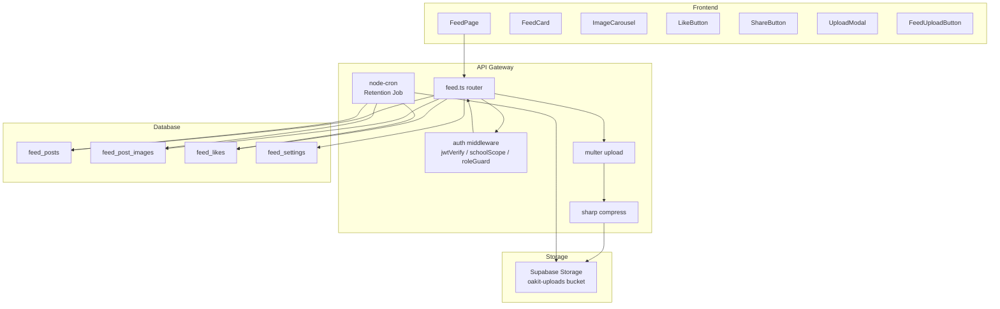
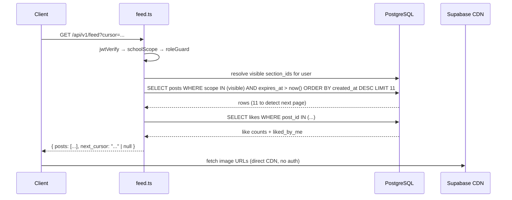

# Design Document: Class Memory Feed

## Overview

Class Memory Feed is a private, Instagram-like photo sharing feature for Oakit's preschool platform. Teachers post daily photo moments from their assigned section; parents view, like, and share those posts scoped strictly to their child's section. Admins and principals post school-wide content visible to all.

The feature is built as a new Express route (`feed.ts`) in `api-gateway`, new database tables, and new frontend pages/components following existing Oakit patterns. It integrates with the existing Supabase Storage bucket, JWT auth middleware, and `pool.query()` DB layer.

### Key Design Decisions

- **Single route file** (`routes/feed.ts`) handles all roles — role-based branching inside handlers rather than separate files, keeping the feed logic co-located.
- **Cursor-based pagination** using `(created_at, id)` composite cursor for stable ordering under concurrent inserts.
- **Client-side compression first** via Canvas API; server-side `sharp` fallback ensures the 300 KB guarantee regardless of client capability.
- **Soft expiry filter** (`expires_at > now()`) on every feed query ensures expired posts are never returned even before the cron job runs.
- **Toggle-like via upsert/delete** — a single `POST /feed/posts/:id/like` endpoint handles both like and unlike atomically.
- **node-cron** for the retention job, registered in `index.ts` alongside existing scheduled tasks.

---

## Architecture



### Request Flow — Feed Retrieval



---

## Components and Interfaces

### Backend — `routes/feed.ts`

```typescript
// Middleware stack applied to all feed routes
router.use(jwtVerify, forceResetGuard, schoolScope);

// Route handlers
GET    /                    → getFeed(req, res)
POST   /posts               → createPost(req, res)   // multer + sharp
DELETE /posts/:id           → deletePost(req, res)   // admin/principal only
POST   /posts/:id/like      → toggleLike(req, res)
GET    /settings            → getSettings(req, res)  // admin only
PUT    /settings            → updateSettings(req, res) // admin only
```

### Authorization Helper — `resolveVisibleSections(user)`

```typescript
async function resolveVisibleSections(user: JwtPayload): Promise<{
  sectionIds: string[];   // empty array means "all sections" (admin)
  schoolWide: boolean;    // always true for all roles
  isAdmin: boolean;
}>
```

- **teacher**: queries `teacher_sections` + `sections.class_teacher_id`
- **parent**: queries `parent_student_links → students.section_id`
- **admin/principal**: returns `isAdmin: true` — no section filter applied

### Image Processing Pipeline

```
Client (Canvas API compress → target 300KB)
  → multipart/form-data
    → multer (disk: /tmp/oakit-uploads/, limit: 10MB per file, max 4/10 files)
      → sharp fallback compress (if file > 300KB after client compress)
        → Supabase Storage upload
          → feed_post_images INSERT
```

### Frontend Components

| Component | Location | Responsibility |
|---|---|---|
| `FeedPage` | `app/{role}/feed/page.tsx` | Route shell, infinite scroll, role-aware FAB |
| `FeedCard` | `features/feed/components/FeedCard.tsx` | Post card: carousel, caption, poster info, actions |
| `ImageCarousel` | `features/feed/components/ImageCarousel.tsx` | Swipeable image viewer (framer-motion drag) |
| `LikeButton` | `features/feed/components/LikeButton.tsx` | Animated heart toggle, optimistic update |
| `ShareButton` | `features/feed/components/ShareButton.tsx` | Web Share API + WhatsApp/Instagram/Facebook fallback |
| `UploadModal` | `features/feed/components/UploadModal.tsx` | Drag-drop/tap select, preview grid, caption, submit |
| `FeedUploadButton` | `features/feed/components/FeedUploadButton.tsx` | Floating "Post Today's Moments" / "Post to School" FAB |
| `useFeed` | `features/feed/hooks/useFeed.ts` | Cursor pagination, SWR/fetch, optimistic like |

---

## Data Models

### `feed_posts`

```sql
CREATE TABLE feed_posts (
  id           UUID PRIMARY KEY DEFAULT gen_random_uuid(),
  school_id    UUID NOT NULL REFERENCES schools(id) ON DELETE CASCADE,
  section_id   UUID REFERENCES sections(id) ON DELETE CASCADE,  -- NULL for school-wide
  class_id     UUID REFERENCES classes(id) ON DELETE SET NULL,  -- NULL for school-wide
  posted_by    UUID NOT NULL,  -- references users.id or parent_users.id
  poster_role  TEXT NOT NULL CHECK (poster_role IN ('teacher', 'admin', 'principal')),
  post_scope   TEXT NOT NULL CHECK (post_scope IN ('section', 'school')),
  caption      TEXT CHECK (char_length(caption) <= 500),
  expires_at   TIMESTAMPTZ NOT NULL,
  created_at   TIMESTAMPTZ NOT NULL DEFAULT now()
);

CREATE INDEX idx_feed_posts_school_scope ON feed_posts (school_id, post_scope, created_at DESC);
CREATE INDEX idx_feed_posts_section ON feed_posts (section_id, created_at DESC) WHERE section_id IS NOT NULL;
CREATE INDEX idx_feed_posts_expires ON feed_posts (expires_at) WHERE expires_at IS NOT NULL;
```

### `feed_post_images`

```sql
CREATE TABLE feed_post_images (
  id            UUID PRIMARY KEY DEFAULT gen_random_uuid(),
  post_id       UUID NOT NULL REFERENCES feed_posts(id) ON DELETE CASCADE,
  storage_path  TEXT NOT NULL,
  cdn_url       TEXT NOT NULL,
  display_order SMALLINT NOT NULL DEFAULT 0
);

CREATE INDEX idx_feed_post_images_post ON feed_post_images (post_id, display_order);
```

### `feed_likes`

```sql
CREATE TABLE feed_likes (
  id         UUID PRIMARY KEY DEFAULT gen_random_uuid(),
  post_id    UUID NOT NULL REFERENCES feed_posts(id) ON DELETE CASCADE,
  user_id    UUID NOT NULL,
  user_type  TEXT NOT NULL CHECK (user_type IN ('staff', 'parent')),
  school_id  UUID NOT NULL REFERENCES schools(id) ON DELETE CASCADE,
  created_at TIMESTAMPTZ NOT NULL DEFAULT now(),
  UNIQUE (post_id, user_id, user_type)
);

CREATE INDEX idx_feed_likes_post ON feed_likes (post_id);
```

### `feed_settings`

```sql
CREATE TABLE feed_settings (
  school_id           UUID PRIMARY KEY REFERENCES schools(id) ON DELETE CASCADE,
  section_daily_limit INT NOT NULL DEFAULT 4  CHECK (section_daily_limit BETWEEN 1 AND 20),
  school_daily_limit  INT NOT NULL DEFAULT 10 CHECK (school_daily_limit BETWEEN 1 AND 100),
  retention_days      INT NOT NULL DEFAULT 20 CHECK (retention_days BETWEEN 1 AND 90)
);
```

### API Response Shape — Feed Post Object

```typescript
interface FeedPost {
  id: string;
  caption: string | null;
  created_at: string;          // ISO 8601
  expires_at: string;          // ISO 8601
  post_scope: 'section' | 'school';
  section_label: string | null; // e.g. "UKG-A", null for school posts
  poster_name: string;
  poster_role: 'teacher' | 'admin' | 'principal';
  images: string[];            // CDN URLs, ordered by display_order
  like_count: number;
  liked_by_me: boolean;
}

interface FeedResponse {
  posts: FeedPost[];
  next_cursor: string | null;  // base64(created_at + '|' + id) or null
}
```

---

## Correctness Properties

*A property is a characteristic or behavior that should hold true across all valid executions of a system — essentially, a formal statement about what the system should do. Properties serve as the bridge between human-readable specifications and machine-verifiable correctness guarantees.*

### Property 1: Parent feed contains only authorized posts

*For any* parent user, every post returned in their feed has either `post_scope = 'school'` OR `section_id` is one of the sections where the parent has an enrolled child — and no post from any other section is included.

**Validates: Requirements 3.1, 3.2, 10.1**

---

### Property 2: Teacher feed contains only authorized posts

*For any* teacher user, every post returned in their feed has either `post_scope = 'school'` OR `section_id` is one of the sections the teacher is assigned to (via `teacher_sections` or `class_teacher_id`) — and no post from any other section is included.

**Validates: Requirements 3.3**

---

### Property 3: Teacher can only post to assigned sections

*For any* teacher and any section, a post creation request succeeds if and only if the teacher appears in `teacher_sections` for that section OR is the `class_teacher_id` of that section.

**Validates: Requirements 1.8**

---

### Property 4: Expired posts never appear in feed responses

*For any* feed response at any point in time, every returned post has `expires_at > now()`. No post whose expiry has passed is ever included, regardless of whether the retention job has run.

**Validates: Requirements 5.7**

---

### Property 5: Like count equals feed_likes row count

*For any* post, the `like_count` value returned in the feed response equals `COUNT(*) FROM feed_likes WHERE post_id = post.id`.

**Validates: Requirements 6.4**

---

### Property 6: Like toggle is a true toggle

*For any* user and post they are authorized to view: if they have not liked the post, liking it creates exactly one row in `feed_likes` and increments `like_count` by 1; if they have already liked it, liking again removes that row and decrements `like_count` by 1.

**Validates: Requirements 6.1, 6.2**

---

### Property 7: Daily post limit is never exceeded

*For any* section and any calendar day, the count of posts with `section_id = X AND DATE(created_at) = today AND school_id = S` never exceeds the school's configured `section_daily_limit`. For school-wide posts, the count with `post_scope = 'school' AND DATE(created_at) = today AND school_id = S` never exceeds `school_daily_limit`.

**Validates: Requirements 1.5, 2.4, 8.3**

---

### Property 8: Post metadata is complete and school-scoped

*For any* created post, the stored record contains: `school_id` matching the poster's JWT, `posted_by` matching the poster's `user_id`, `post_scope` set correctly (`'section'` for teachers, `'school'` for admin/principal), `section_id` present for section posts and NULL for school posts, and `expires_at = created_at + retention_days`.

**Validates: Requirements 1.4, 2.3, 5.1, 10.1**

---

### Property 9: Storage paths follow the required pattern

*For any* section post image, its `storage_path` matches `{school_id}/memory-feed/sections/{section_id}/{post_id}/{filename}`. *For any* school-wide post image, its `storage_path` matches `{school_id}/memory-feed/school/{post_id}/{filename}`.

**Validates: Requirements 9.1, 9.2**

---

### Property 10: Tenant isolation — no cross-school data

*For any* user request, every post and like record returned has `school_id` equal to the `school_id` encoded in the requester's JWT. No record from a different school is ever returned.

**Validates: Requirements 3.5, 10.1, 10.3**

---

### Property 11: Deleted post cascade removes all associated data

*For any* post deletion (by admin or by retention job), after the operation completes: no row exists in `feed_posts` with that `id`, no row exists in `feed_post_images` with that `post_id`, and no row exists in `feed_likes` with that `post_id`.

**Validates: Requirements 5.2, 5.3, 5.4, 8.2**

---

### Property 12: Configured retention period is applied to new posts

*For any* school with `feed_settings.retention_days = R`, every post created for that school has `expires_at = created_at + R days`. When no `feed_settings` row exists, `R = 20`.

**Validates: Requirements 5.5, 5.6**

---

### Property 13: Image compression guarantees ≤ 300 KB output

*For any* image input (JPEG or PNG, up to 10 MB), after passing through the Image_Processor (client Canvas API or server-side sharp fallback), the resulting file size is ≤ 300 KB.

**Validates: Requirements 1.3**

---

### Property 14: Share text contains no PII

*For any* post, the text string generated by `Share_Handler` for the Web Share API contains the school name and the fixed suffix `"❤️"` but does not contain any student name, parent name, or other personally identifiable information.

**Validates: Requirements 7.4**

---

## Error Handling

| Scenario | HTTP Status | Response Body |
|---|---|---|
| Missing / invalid JWT | 401 | `{ error: 'Missing authorization token' }` |
| Cross-school request | 403 | `{ error: 'Access denied: cross-school request' }` |
| Teacher posting to unassigned section | 403 | `{ error: 'Not authorized for this section' }` |
| Parent liking post outside their scope | 403 | `{ error: 'Not authorized' }` |
| Daily section limit reached | 429 | `{ error: 'Daily section post limit reached', limit: N }` |
| Daily school limit reached | 429 | `{ error: 'Daily school post limit reached', limit: N }` |
| Invalid MIME type | 400 | `{ error: 'Images must be JPEG or PNG' }` |
| Too many images | 400 | `{ error: 'Maximum N images per post' }` |
| Single image > 10 MB | 400 | `{ error: 'Each image must be under 10 MB' }` |
| Caption > 500 chars | 400 | `{ error: 'Caption must be 500 characters or less' }` |
| Storage upload failure | 500 | `{ error: 'Upload failed, post was not saved' }` (post rolled back) |
| Post not found | 404 | `{ error: 'Post not found' }` |

### Storage Rollback Strategy

Post creation is a two-phase operation: (1) upload images to Supabase Storage, (2) insert `feed_posts` + `feed_post_images` rows. If step 2 fails, all uploaded storage objects are deleted before returning 500. If step 1 partially fails (some images uploaded, some not), all successfully uploaded objects are cleaned up.

```typescript
const uploadedPaths: string[] = [];
try {
  for (const file of files) {
    const { storagePath, publicUrl } = await uploadFeedImage(...);
    uploadedPaths.push(storagePath);
  }
  // DB inserts...
} catch (err) {
  // Rollback all uploaded storage objects
  await Promise.allSettled(uploadedPaths.map(p => supabase.storage.from(BUCKET).remove([p])));
  return res.status(500).json({ error: 'Upload failed, post was not saved' });
}
```

---

## Testing Strategy

### Unit Tests (example-based)

- `resolveVisibleSections` returns correct section IDs for each role
- Caption validation rejects strings > 500 chars
- MIME type filter rejects non-JPEG/PNG
- Image count validation rejects 0 and > 4 (teacher) / > 10 (admin)
- Cursor encoding/decoding round-trip
- Share text generation does not include student names
- Default retention (20 days) when no `feed_settings` row exists
- 401 returned when no JWT present
- 403 returned when JWT school_id mismatches resource school_id

### Property-Based Tests

Uses **fast-check** (TypeScript PBT library). Each test runs a minimum of 100 iterations.

**Tag format:** `// Feature: class-memory-feed, Property N: <property_text>`

| Property | Test Description | Generator |
|---|---|---|
| P1 — Parent feed authorization | For any parent with N children in M sections, feed contains only school posts + those M sections' posts | Arbitrary parent with random section assignments |
| P2 — Teacher feed authorization | For any teacher assigned to K sections, feed contains only school posts + those K sections' posts | Arbitrary teacher with random section assignments |
| P3 — Teacher post authorization | For any teacher-section pair, post succeeds iff teacher is assigned | Arbitrary teacher, arbitrary section, random assignment state |
| P4 — Expired post exclusion | For any feed response, all posts have expires_at > now() | Arbitrary mix of expired and active posts in DB |
| P5 — Like count accuracy | For any post, feed like_count = COUNT(feed_likes) | Arbitrary post with random like records |
| P6 — Like toggle | For any user-post pair, like/unlike toggles correctly | Arbitrary user, post, initial like state |
| P7 — Daily limit enforcement | For any section/school, post count never exceeds configured limit | Arbitrary limit value, arbitrary post sequence |
| P8 — Post metadata completeness | For any created post, all required fields are present and correct | Arbitrary valid post creation payload |
| P9 — Storage path format | For any post, image paths match required pattern | Arbitrary post_id, section_id, school_id, filename |
| P10 — Tenant isolation | For any user, all returned records have matching school_id | Arbitrary multi-school DB state |
| P11 — Delete cascade | For any deleted post, no orphaned images or likes remain | Arbitrary post with random images and likes |
| P12 — Retention period applied | For any retention_days R, new posts have expires_at = created_at + R days | Arbitrary R in [1, 90] |
| P13 — Compression output ≤ 300 KB | For any valid image input, compressed output ≤ 300 KB | Arbitrary JPEG/PNG buffers of varying sizes |
| P14 — Share text has no PII | For any post, share text contains no student/parent names | Arbitrary post with random student name fields |

### Integration Tests

- Retention job deletes expired posts and their Supabase Storage objects (1-2 examples with mocked Supabase)
- Admin delete removes post + images from storage + likes (example-based with mocked storage)
- Feed settings GET/PUT round-trip persists correctly

### Smoke Tests

- No comment endpoints exist in the API
- Like response time < 500ms under normal load (manual/load test)
- Error messages do not expose internal DB identifiers
