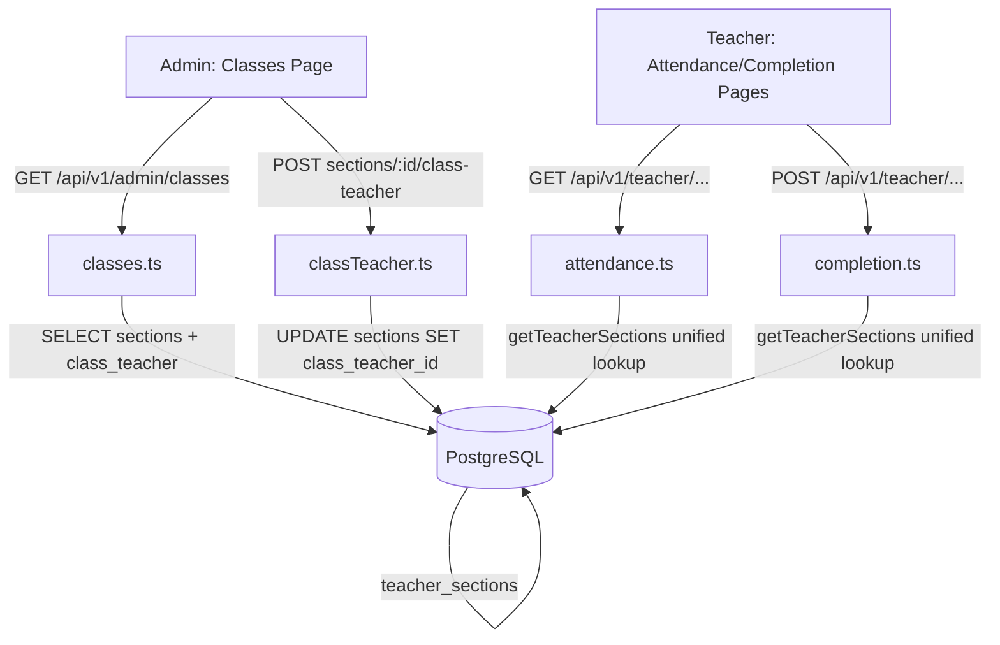
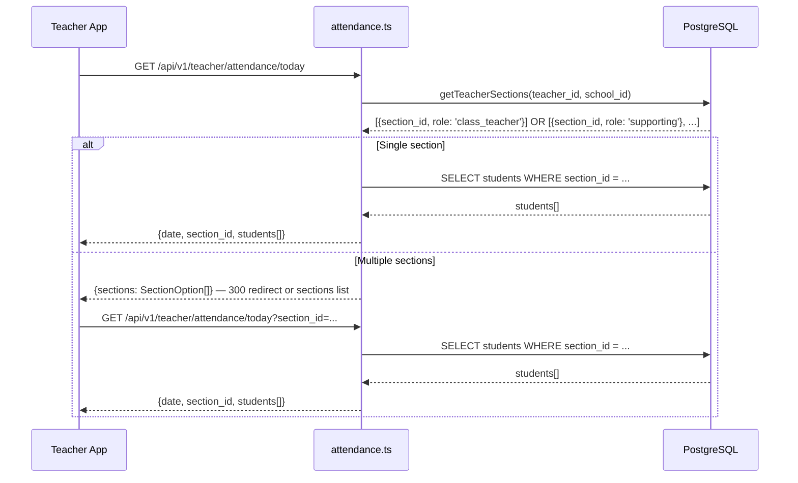
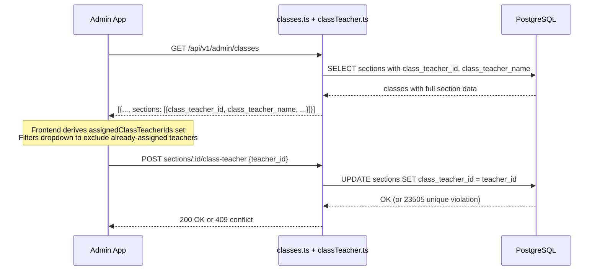

# Design Document: Class Teacher Role Enforcement

## Overview

This feature enforces a proper distinction between class teachers (one per section, primary responsible) and supporting teachers (many per section, via `teacher_sections`). It fixes a bug where `getTeacherSection` only queries `teacher_sections`, causing class teachers to get "No section assigned" errors, and adds multi-section selection for supporting teachers. It also ensures the admin UI filters out already-assigned class teachers and that the classes API returns `class_teacher_id`/`class_teacher_name`.

## Architecture



## Components and Interfaces

### Component 1: `getTeacherSections` helper (shared utility)

**Purpose**: Resolve all sections a teacher is authorized to act on, checking both class teacher role and supporting teacher assignments.

**Interface**:
```typescript
interface TeacherSectionInfo {
  section_id: string;
  role: 'class_teacher' | 'supporting';
}

async function getTeacherSections(
  teacher_id: string,
  school_id: string
): Promise<TeacherSectionInfo[]>
```

**Responsibilities**:
- Query `sections WHERE class_teacher_id = teacher_id AND school_id = school_id`
- Query `teacher_sections JOIN sections WHERE teacher_id = teacher_id AND school_id = school_id`
- Merge results, deduplicating by `section_id` (class_teacher role takes precedence if both)
- Return empty array (not null) when no sections found

### Component 2: `GET /api/v1/admin/classes` (classes.ts)

**Purpose**: Return classes with sections including class teacher data.

**Interface** — section shape in response:
```typescript
interface SectionResponse {
  id: string;
  label: string;
  class_teacher_id: string | null;
  class_teacher_name: string | null;
  teachers: { id: string; name: string }[];  // supporting teachers only
}
```

**Responsibilities**:
- Join `sections` with `users` on `class_teacher_id` to get `class_teacher_name`
- Include `class_teacher_id` and `class_teacher_name` in the JSON aggregation

### Component 3: Admin Classes Page (frontend)

**Purpose**: Show class teacher assignment with filtered dropdown.

**Responsibilities**:
- Collect the set of `class_teacher_id` values already assigned across all sections
- Filter `allTeachers` in the class teacher dropdown to exclude teachers already assigned as class teacher in any other section
- Display `class_teacher_name` from API response (already handled in existing code once API returns it)

### Component 4: Teacher Attendance/Completion Pages (frontend)

**Purpose**: Allow teachers with multiple sections to select which section they're acting on.

**Interface**:
```typescript
interface SectionOption {
  section_id: string;
  section_label: string;
  class_name: string;
  role: 'class_teacher' | 'supporting';
}
```

**Responsibilities**:
- On load, call `GET /api/v1/teacher/sections` to get all sections for the teacher
- If only one section: proceed as today (no UI change)
- If multiple sections: show a section selector before the attendance/completion form
- Pass selected `section_id` as query param or in request body

### Component 5: `GET /api/v1/teacher/sections` (new endpoint)

**Purpose**: Return all sections a teacher is authorized to act on.

**Responsibilities**:
- Use `getTeacherSections` helper
- Return section list with class name, label, and role

## Data Models

### Existing (no schema changes needed)

```sql
-- sections table (migration 003 + 008)
sections (
  id UUID,
  school_id UUID,
  class_id UUID,
  label TEXT,
  class_teacher_id UUID REFERENCES users(id)  -- added in 008, unique per school
)

-- teacher_sections table (migration 003)
teacher_sections (
  teacher_id UUID,
  section_id UUID,
  PRIMARY KEY (teacher_id, section_id)
)
```

No new migrations are required. The unique index `sections_class_teacher_school_unique` already enforces one class teacher per section per school at the DB level.

### API Response Shape Change

The only "model" change is the `GET /api/v1/admin/classes` response — sections now include:

```typescript
// Before
{ id, label, teachers[] }

// After
{ id, label, class_teacher_id, class_teacher_name, teachers[] }
```

## Sequence Diagrams

### Teacher Loads Attendance (fixed flow)



### Admin Assigns Class Teacher (filtered dropdown)



## API Changes

### 1. `GET /api/v1/admin/classes` — add class teacher fields to section JSON

Change the `json_build_object` in the SQL query to include:

```sql
json_build_object(
  'id', s.id,
  'label', s.label,
  'class_teacher_id', s.class_teacher_id,
  'class_teacher_name', ct.name,   -- LEFT JOIN users ct ON ct.id = s.class_teacher_id
  'teachers', (
    SELECT COALESCE(json_agg(json_build_object('id', u.id, 'name', u.name)), '[]')
    FROM teacher_sections ts2
    JOIN users u ON ts2.teacher_id = u.id
    WHERE ts2.section_id = s.id
  )
)
```

### 2. Replace `getTeacherSection` with `getTeacherSections` in attendance.ts and completion.ts

New shared helper (can live in `src/lib/teacherSection.ts`):

```typescript
export async function getTeacherSections(
  teacher_id: string,
  school_id: string
): Promise<{ section_id: string; role: 'class_teacher' | 'supporting' }[]> {
  const [ctRow, tsRows] = await Promise.all([
    pool.query(
      `SELECT id AS section_id FROM sections
       WHERE class_teacher_id = $1 AND school_id = $2`,
      [teacher_id, school_id]
    ),
    pool.query(
      `SELECT ts.section_id FROM teacher_sections ts
       JOIN sections s ON ts.section_id = s.id
       WHERE ts.teacher_id = $1 AND s.school_id = $2`,
      [teacher_id, school_id]
    ),
  ]);

  const result = new Map<string, 'class_teacher' | 'supporting'>();
  for (const r of ctRow.rows) result.set(r.section_id, 'class_teacher');
  for (const r of tsRows.rows) {
    if (!result.has(r.section_id)) result.set(r.section_id, 'supporting');
  }
  return Array.from(result.entries()).map(([section_id, role]) => ({ section_id, role }));
}
```

### 3. New `GET /api/v1/teacher/sections` endpoint

Returns all sections the authenticated teacher can act on:

```typescript
// Response
[{
  section_id: string;
  section_label: string;
  class_name: string;
  role: 'class_teacher' | 'supporting';
}]
```

### 4. Update attendance.ts and completion.ts route handlers

- Replace `getTeacherSection(...)` calls with `getTeacherSections(...)`
- If result is empty → 404 `No section assigned`
- If result has exactly one entry → use it directly (no behavior change for single-section teachers)
- If result has multiple entries → require `section_id` query param; validate the requested section is in the teacher's list; return 400 if missing or 403 if not authorized

## Frontend Changes

### Admin Classes Page (`admin/classes/page.tsx`)

Derive the set of already-assigned class teacher IDs from loaded data and filter the dropdown:

```typescript
// Derive set of assigned class teacher IDs across all sections
const assignedClassTeacherIds = new Set(
  classes.flatMap(c => c.sections.map(s => s.class_teacher_id).filter(Boolean))
);

// In the dropdown render, filter out already-assigned teachers (except current section's own teacher)
allTeachers
  .filter(t => !assignedClassTeacherIds.has(t.id) || t.id === sec.class_teacher_id)
  .map(t => <option key={t.id} value={t.id}>{t.name}</option>)
```

No other changes needed — `class_teacher_name` display is already implemented, it just needs the API to return the value.

### Teacher Attendance Page (`teacher/attendance/page.tsx`)

Add section selection for multi-section teachers:

```typescript
// On load: fetch teacher's sections
const sections = await apiGet<SectionOption[]>('/api/v1/teacher/sections', token);

// If sections.length === 1: auto-select, proceed as before
// If sections.length > 1: show section picker UI before attendance form
// Pass ?section_id=... to all attendance API calls
```

The same pattern applies to any curriculum completion page that uses `getTeacherSection`.

## Error Handling

| Scenario | Current Behavior | Fixed Behavior |
|---|---|---|
| Class teacher not in `teacher_sections` | 404 "No section assigned" | Resolved via `sections.class_teacher_id` lookup |
| Supporting teacher in multiple sections, no `section_id` param | Returns first section silently | 400 "section_id required — you are assigned to multiple sections" |
| Supporting teacher requests unauthorized section | N/A | 403 "Not authorized for this section" |
| Admin assigns already-class-teacher to another section | 409 from DB unique violation (shown as error) | Dropdown pre-filters them out; DB constraint remains as safety net |

## Testing Strategy

### Unit Testing

- `getTeacherSections`: test with class teacher only, supporting only, both, neither, overlap (same section via both paths)
- Admin classes query: verify `class_teacher_id` and `class_teacher_name` present in response
- Attendance route: test single-section auto-resolve, multi-section with valid param, multi-section without param (400), unauthorized section (403)

### Property-Based Testing

- For any teacher with N assigned sections (class + supporting combined), `getTeacherSections` returns exactly N unique `section_id` values
- Class teacher role always takes precedence over supporting role for the same section

### Integration Testing

- End-to-end: assign class teacher → remove from `teacher_sections` → teacher can still take attendance
- End-to-end: supporting teacher in 2 sections → must select section → attendance submitted to correct section

## Dependencies

- No new npm packages required
- No new DB migrations required (schema already supports this)
- Shared helper `src/lib/teacherSection.ts` is a new file extracted from duplicated logic in `attendance.ts` and `completion.ts`

## Correctness Properties

*A property is a characteristic or behavior that should hold true across all valid executions of a system — essentially, a formal statement about what the system should do. Properties serve as the bridge between human-readable specifications and machine-verifiable correctness guarantees.*

### Property 1: Section resolution completeness and uniqueness

*For any* teacher with any combination of class teacher assignments (via `sections.class_teacher_id`) and supporting teacher assignments (via `teacher_sections`), `getTeacherSections` returns an array where every assigned section appears exactly once and no section appears more than once.

**Validates: Requirements 1.1, 1.2, 1.3, 1.6**

### Property 2: Class teacher role precedence on overlap

*For any* teacher who is assigned as both class teacher and supporting teacher for the same section, `getTeacherSections` returns that section with role `class_teacher`, not `supporting`.

**Validates: Requirements 1.4**

### Property 3: Admin classes API section shape completeness

*For any* school with any number of sections (with or without class teachers assigned), every section object returned by `GET /api/v1/admin/classes` contains both `class_teacher_id` and `class_teacher_name` fields, and when `class_teacher_id` is non-null the `class_teacher_name` matches the corresponding user's name.

**Validates: Requirements 2.1, 2.2, 2.3**

### Property 4: Admin dropdown excludes already-assigned class teachers

*For any* set of sections loaded by the Admin_Classes_Page, the class teacher dropdown for a given section contains only teachers who are not already assigned as class teacher in any other section (the current section's own class teacher is always included).

**Validates: Requirements 3.1, 3.2**

### Property 5: Teacher sections API response shape

*For any* authenticated teacher, `GET /api/v1/teacher/sections` returns an array where every element contains `section_id`, `section_label`, `class_name`, and `role` fields, and the set of `section_id` values matches the output of `getTeacherSections` for that teacher.

**Validates: Requirements 4.1**

### Property 6: Single-section teachers need no section_id param

*For any* teacher with exactly one authorized section, the Attendance_API and Completion_API SHALL process requests successfully without a `section_id` parameter, using the single section automatically.

**Validates: Requirements 5.3, 6.3**

### Property 7: Multi-section teachers require section_id param

*For any* teacher with two or more authorized sections, the Attendance_API and Completion_API SHALL return HTTP 400 when no `section_id` parameter is provided, and SHALL return HTTP 403 when a `section_id` outside the teacher's authorized list is provided.

**Validates: Requirements 5.4, 5.5, 5.6, 6.4, 6.5, 6.6**

### Property 8: Teacher attendance page section picker visibility

*For any* teacher, the Teacher_Attendance_Page SHALL show the section picker UI if and only if the Teacher_Sections_API returns more than one section, and SHALL skip the picker and proceed directly when exactly one section is returned.

**Validates: Requirements 7.2, 7.3**
