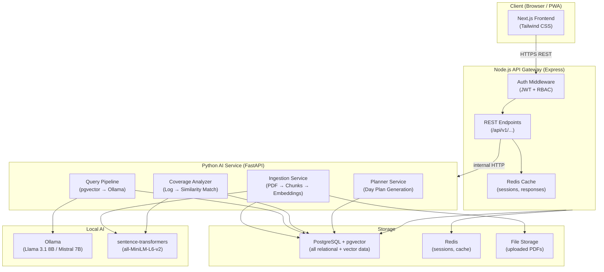
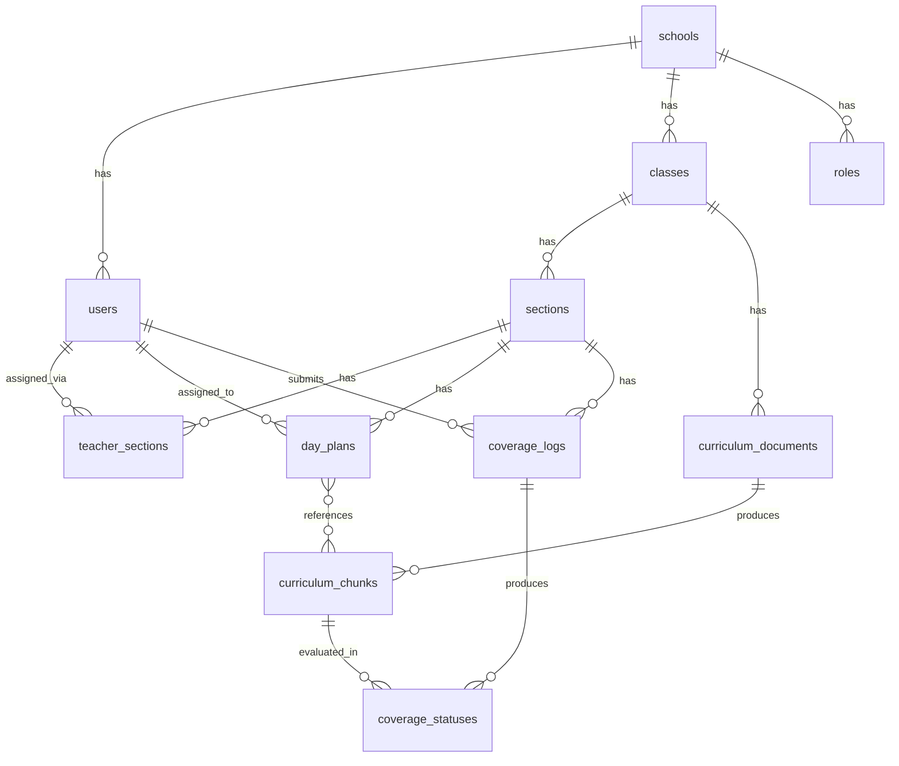
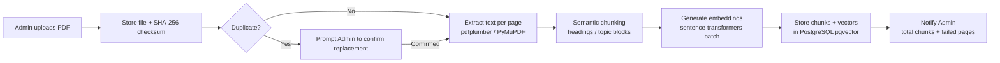
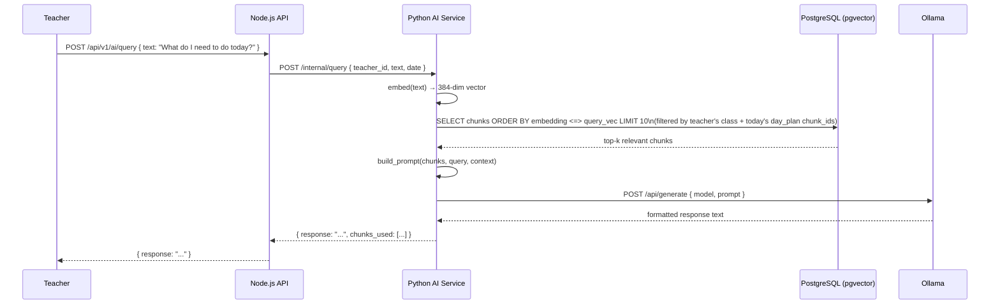
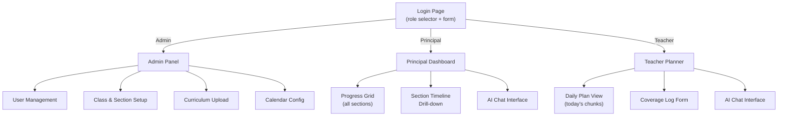

# Design Document: Oakit.ai Curriculum Management Platform

## Overview

Oakit.ai is a school curriculum management platform that uses local AI (Ollama + sentence-transformers) to help teachers plan lessons, log coverage, and query curriculum content — all without paid API calls. The intelligence comes primarily from **vector similarity search** (pgvector retrieving the right curriculum chunks) while the local LLM (Llama 3.1 8B or Mistral 7B via Ollama) handles formatting and summarization of retrieved context.

### Core Design Principles

- **Free stack only**: No paid AI APIs. All AI runs locally via Ollama and sentence-transformers.
- **RAG-first**: Retrieval-Augmented Generation — the LLM never hallucinates curriculum content because it only formats what pgvector retrieves.
- **Multi-school isolation**: Every entity is scoped to a `school_id` enforced at the database and API layer.
- **Extensible roles**: Permissions are data-driven, not hard-coded.
- **PWA-ready**: Next.js frontend with responsive design for mobile access without a native app.

### Technology Stack

| Layer | Technology | Rationale |
|---|---|---|
| Frontend | Next.js + Tailwind CSS | React SSR, PWA support, fast iteration |
| API Gateway | Node.js + Express | Auth, REST routing, session management |
| AI Service | Python + FastAPI | PDF ingestion, embeddings, LLM orchestration |
| LLM | Ollama (Llama 3.1 8B / Mistral 7B) | Free, local, no API cost |
| Embeddings | sentence-transformers (`all-MiniLM-L6-v2`) | Free, local, 384-dim vectors |
| Orchestration | LangChain | Prompt chaining, retrieval pipelines |
| Database | PostgreSQL + pgvector | Relational + vector storage in one DB |
| Cache / Sessions | Redis | JWT session store, response caching |
| PDF Parsing | pdfplumber / PyMuPDF | Free, reliable text extraction |

---

## Architecture

### System Architecture Diagram



### Service Communication

- **Frontend → Node.js API**: HTTPS REST, JWT in `Authorization: Bearer` header.
- **Node.js API → Python AI Service**: Internal HTTP (same network), no public exposure.
- **Python AI Service → Ollama**: HTTP to `localhost:11434` (Ollama default port).
- **Python AI Service → sentence-transformers**: In-process Python call (no network hop).
- **Both services → PostgreSQL**: Direct connection pool (pg for Node, asyncpg/SQLAlchemy for Python).

### Deployment Topology (Phase 1 — Single Server)

All services run on a single Linux server (e.g., a school's on-premise machine or a VPS):

```
/opt/oakit/
  node-api/        # Node.js Express app (PM2)
  python-ai/       # FastAPI app (uvicorn)
  frontend/        # Next.js build (PM2 or nginx static)
  ollama/          # Ollama daemon (systemd)
nginx              # Reverse proxy (SSL termination, routing)
postgresql         # PostgreSQL with pgvector extension
redis              # Redis server
```

---

## Components and Interfaces

### 1. Node.js API Gateway

Handles all client-facing requests. Responsibilities:
- JWT issuance and validation
- Role-based access control (RBAC) enforcement
- School-scoping middleware (injects `school_id` from JWT into every query)
- Proxying AI-related requests to the Python service
- CRUD for schools, users, classes, sections, calendar

**Key Middleware Stack:**
```
Request → cors → rateLimit → jwtVerify → schoolScope → roleGuard → handler
```

### 2. Python AI Service (FastAPI)

Handles all AI-intensive operations. Responsibilities:
- PDF ingestion pipeline
- Embedding generation (sentence-transformers)
- pgvector similarity queries
- Ollama LLM calls
- Day plan generation logic
- Coverage analysis

Exposes internal REST endpoints consumed only by the Node.js API.

### 3. Next.js Frontend

Four primary screen groups:
- **Login**: Role selector + credential form
- **Admin Panel**: User management, class/section setup, curriculum upload, calendar config
- **Teacher Planner**: Chat UI + daily plan view + coverage log form
- **Principal Dashboard**: School-wide progress grid + section drill-down

### 4. Ollama Integration Pattern

```python
# ollama_client.py
import httpx

OLLAMA_BASE = "http://localhost:11434"
DEFAULT_MODEL = "llama3.1:8b"  # or "mistral:7b"

async def generate(prompt: str, model: str = DEFAULT_MODEL) -> str:
    async with httpx.AsyncClient(timeout=30.0) as client:
        resp = await client.post(
            f"{OLLAMA_BASE}/api/generate",
            json={"model": model, "prompt": prompt, "stream": False}
        )
        resp.raise_for_status()
        return resp.json()["response"]
```

The Ollama client is injected as a dependency in FastAPI, making it trivially swappable:

```python
# To swap to OpenAI later — only this file changes:
async def generate(prompt: str, model: str = "gpt-4o-mini") -> str:
    client = openai.AsyncOpenAI()
    resp = await client.chat.completions.create(
        model=model,
        messages=[{"role": "user", "content": prompt}]
    )
    return resp.choices[0].message.content
```

### 5. Embedding Service

```python
# embeddings.py
from sentence_transformers import SentenceTransformer

_model = SentenceTransformer("all-MiniLM-L6-v2")  # loaded once at startup

def embed(text: str) -> list[float]:
    return _model.encode(text).tolist()  # 384-dim vector

def embed_batch(texts: list[str]) -> list[list[float]]:
    return _model.encode(texts).tolist()
```

---

## Data Models

### Database Schema

```sql
-- Enable pgvector
CREATE EXTENSION IF NOT EXISTS vector;

-- Schools
CREATE TABLE schools (
    id          UUID PRIMARY KEY DEFAULT gen_random_uuid(),
    name        TEXT NOT NULL,
    subdomain   TEXT NOT NULL UNIQUE,
    contact     JSONB,
    created_at  TIMESTAMPTZ DEFAULT now()
);

-- Roles (data-driven, extensible)
CREATE TABLE roles (
    id          UUID PRIMARY KEY DEFAULT gen_random_uuid(),
    school_id   UUID REFERENCES schools(id) ON DELETE CASCADE,
    name        TEXT NOT NULL,                    -- 'admin', 'principal', 'teacher'
    permissions JSONB NOT NULL DEFAULT '[]',      -- ["read:classes", "write:coverage_logs", ...]
    UNIQUE(school_id, name)
);

-- Users
CREATE TABLE users (
    id              UUID PRIMARY KEY DEFAULT gen_random_uuid(),
    school_id       UUID NOT NULL REFERENCES schools(id) ON DELETE CASCADE,
    role_id         UUID NOT NULL REFERENCES roles(id),
    name            TEXT NOT NULL,
    email           TEXT NOT NULL UNIQUE,
    password_hash   TEXT,
    setup_token     TEXT,                         -- one-time credential setup link
    setup_expires   TIMESTAMPTZ,
    created_at      TIMESTAMPTZ DEFAULT now()
);

-- Classes (e.g., LKG, UKG, Prep1)
CREATE TABLE classes (
    id          UUID PRIMARY KEY DEFAULT gen_random_uuid(),
    school_id   UUID NOT NULL REFERENCES schools(id) ON DELETE CASCADE,
    name        TEXT NOT NULL,
    UNIQUE(school_id, name)
);

-- Sections (e.g., LKG-A, LKG-B)
CREATE TABLE sections (
    id          UUID PRIMARY KEY DEFAULT gen_random_uuid(),
    school_id   UUID NOT NULL REFERENCES schools(id) ON DELETE CASCADE,
    class_id    UUID NOT NULL REFERENCES classes(id) ON DELETE CASCADE,
    label       TEXT NOT NULL,                    -- 'A', 'B', etc.
    UNIQUE(class_id, label)
);

-- Teacher ↔ Section assignments (many-to-many)
CREATE TABLE teacher_sections (
    teacher_id  UUID NOT NULL REFERENCES users(id) ON DELETE CASCADE,
    section_id  UUID NOT NULL REFERENCES sections(id) ON DELETE CASCADE,
    PRIMARY KEY (teacher_id, section_id)
);

-- School calendar
CREATE TABLE school_calendar (
    id              UUID PRIMARY KEY DEFAULT gen_random_uuid(),
    school_id       UUID NOT NULL REFERENCES schools(id) ON DELETE CASCADE,
    academic_year   TEXT NOT NULL,                -- '2024-25'
    working_days    INT[] NOT NULL,               -- [1,2,3,4,5] = Mon-Fri
    start_date      DATE NOT NULL,
    end_date        DATE NOT NULL,
    holidays        DATE[] NOT NULL DEFAULT '{}'
);

-- Curriculum documents
CREATE TABLE curriculum_documents (
    id              UUID PRIMARY KEY DEFAULT gen_random_uuid(),
    school_id       UUID NOT NULL REFERENCES schools(id) ON DELETE CASCADE,
    class_id        UUID NOT NULL REFERENCES classes(id) ON DELETE CASCADE,
    filename        TEXT NOT NULL,
    file_path       TEXT NOT NULL,
    checksum        TEXT NOT NULL,               -- SHA-256 for duplicate detection
    status          TEXT NOT NULL DEFAULT 'pending',  -- pending, processing, ready, failed
    total_chunks    INT,
    failed_pages    JSONB DEFAULT '[]',          -- [{page: 5, reason: "..."}]
    uploaded_by     UUID REFERENCES users(id),
    uploaded_at     TIMESTAMPTZ DEFAULT now()
);

-- Curriculum chunks (with pgvector embedding)
CREATE TABLE curriculum_chunks (
    id              UUID PRIMARY KEY DEFAULT gen_random_uuid(),
    school_id       UUID NOT NULL REFERENCES schools(id) ON DELETE CASCADE,
    document_id     UUID NOT NULL REFERENCES curriculum_documents(id) ON DELETE CASCADE,
    class_id        UUID NOT NULL REFERENCES classes(id) ON DELETE CASCADE,
    chunk_index     INT NOT NULL,                -- sequential order within document
    topic_label     TEXT,
    content         TEXT NOT NULL,              -- original extracted text, unmodified
    page_start      INT,
    page_end        INT,
    activity_ids    TEXT[] DEFAULT '{}',        -- referenced activity identifiers
    embedding       vector(384),               -- sentence-transformers all-MiniLM-L6-v2
    created_at      TIMESTAMPTZ DEFAULT now()
);

CREATE INDEX ON curriculum_chunks USING ivfflat (embedding vector_cosine_ops)
    WITH (lists = 100);
CREATE INDEX ON curriculum_chunks (class_id, chunk_index);

-- Day plans
CREATE TABLE day_plans (
    id              UUID PRIMARY KEY DEFAULT gen_random_uuid(),
    school_id       UUID NOT NULL REFERENCES schools(id) ON DELETE CASCADE,
    section_id      UUID NOT NULL REFERENCES sections(id) ON DELETE CASCADE,
    teacher_id      UUID NOT NULL REFERENCES users(id),
    plan_date       DATE NOT NULL,
    chunk_ids       UUID[] NOT NULL,            -- ordered list of chunks for this day
    status          TEXT NOT NULL DEFAULT 'scheduled',  -- scheduled, delivered, partial, carried_forward
    UNIQUE(section_id, plan_date)
);

CREATE INDEX ON day_plans (teacher_id, plan_date);

-- Coverage logs
CREATE TABLE coverage_logs (
    id              UUID PRIMARY KEY DEFAULT gen_random_uuid(),
    school_id       UUID NOT NULL REFERENCES schools(id) ON DELETE CASCADE,
    section_id      UUID NOT NULL REFERENCES sections(id) ON DELETE CASCADE,
    teacher_id      UUID NOT NULL REFERENCES users(id),
    log_date        DATE NOT NULL,
    log_text        TEXT NOT NULL,
    submitted_at    TIMESTAMPTZ DEFAULT now(),
    edited_at       TIMESTAMPTZ,
    flagged         BOOLEAN DEFAULT false,      -- true if no chunks matched
    UNIQUE(section_id, log_date)
);

-- Coverage status per chunk (output of Coverage_Analyzer)
CREATE TABLE coverage_statuses (
    id              UUID PRIMARY KEY DEFAULT gen_random_uuid(),
    coverage_log_id UUID NOT NULL REFERENCES coverage_logs(id) ON DELETE CASCADE,
    chunk_id        UUID NOT NULL REFERENCES curriculum_chunks(id),
    status          TEXT NOT NULL,              -- 'covered', 'partial', 'pending'
    similarity_score FLOAT,
    UNIQUE(coverage_log_id, chunk_id)
);
```

### Entity Relationship Summary



---

## PDF Ingestion Pipeline

### Pipeline Stages



### Chunking Strategy

```python
# chunker.py
import re
from dataclasses import dataclass

HEADING_PATTERN = re.compile(r'^(#{1,3}|\d+\.\s|[A-Z][A-Z\s]{3,}:)', re.MULTILINE)
MAX_CHUNK_TOKENS = 400
MIN_CHUNK_TOKENS = 50

@dataclass
class Chunk:
    content: str
    topic_label: str
    page_start: int
    page_end: int
    activity_ids: list[str]

def chunk_document(pages: list[dict]) -> list[Chunk]:
    """
    pages: [{"page_num": 1, "text": "..."}]
    Strategy: split on heading patterns, then enforce max token size.
    """
    ...
```

Activity identifiers are extracted with a secondary regex pass looking for patterns like `WB p.12`, `SB Ex.3`, `Worksheet 4A`.

### Ingestion API Endpoint (Python FastAPI)

```
POST /internal/ingest
Body: { document_id: UUID }
Response: { chunks_created: int, failed_pages: [{page, reason}] }
```

---

## Day Plan Generation Algorithm

### Algorithm

```
Input: class_id, section_id, calendar_id
Output: day_plans rows for every working day

1. Fetch all curriculum_chunks for class_id ordered by chunk_index
2. Fetch working days from school_calendar (exclude holidays)
3. Compute chunks_per_day = ceil(total_chunks / total_working_days)
4. Assign chunks sequentially: day 1 gets chunks[0..n], day 2 gets chunks[n..2n], etc.
5. Insert day_plans rows (section_id, teacher_id, plan_date, chunk_ids)
```

### Carry-Forward Logic

When a Coverage_Log is submitted:
1. Coverage_Analyzer determines which chunks are `pending` or `partial`.
2. Planner_Service prepends those chunks to the next available working day's `chunk_ids`.
3. If the next day already has a full load, it creates an overflow plan or extends the day.

### Absence Handling

When Admin marks a teacher absent for a date:
1. The day's `day_plan.status` is set to `carried_forward`.
2. All `chunk_ids` from that plan are prepended to the next working day.

---

## AI Query Pipeline

### Query Flow



### Prompt Templates

**Daily Plan Query:**
```python
DAILY_PLAN_PROMPT = """You are a helpful curriculum assistant for a school teacher.
Based on the following curriculum content scheduled for today, provide a clear, 
structured daily plan. Be concise and practical.

Today's scheduled curriculum content:
{chunks}

Pending items from previous days:
{pending_chunks}

Teacher's question: {query}

Respond with:
1. Today's topics and activities (in order)
2. Any pending items to address
3. Brief notes on each activity if available
"""
```

**Coverage Summary Query:**
```python
COVERAGE_SUMMARY_PROMPT = """You are a curriculum tracking assistant.
Summarize what was covered and what remains pending based on the coverage log below.

Coverage log: {log_text}
Matched curriculum chunks: {matched_chunks}
Unmatched scheduled chunks: {unmatched_chunks}

Provide a brief summary of: what was covered, what is pending, and any gaps.
"""
```

**Activity Help Query:**
```python
ACTIVITY_HELP_PROMPT = """You are a teaching assistant helping a teacher conduct a classroom activity.
Using only the curriculum content provided below, explain how to conduct the requested activity.

Curriculum content: {chunk_content}

Teacher's question: {query}

Provide: objectives, materials needed, and step-by-step instructions.
If the information is not in the curriculum content, say so clearly.
"""
```

**Principal Progress Query:**
```python
PRINCIPAL_PROGRESS_PROMPT = """You are a school curriculum analyst.
Based on the coverage data below, provide a concise progress report.

Coverage data by section:
{coverage_data}

Principal's question: {query}

Provide: completion percentages, sections behind schedule, and key observations.
"""
```

### Retrieval Strategy

For teacher queries, the vector search is **constrained** to the teacher's relevant chunks:

```sql
SELECT c.id, c.content, c.topic_label, c.activity_ids,
       1 - (c.embedding <=> $1) AS similarity
FROM curriculum_chunks c
WHERE c.class_id = $2
  AND c.id = ANY($3)          -- $3 = today's day_plan chunk_ids + pending chunk_ids
ORDER BY similarity DESC
LIMIT 10;
```

This ensures the LLM only sees curriculum content relevant to the teacher's current plan, not the entire corpus.

---

## Coverage Analyzer

### Analysis Flow

```python
async def analyze_coverage(log_id: UUID, log_text: str, day_plan_chunk_ids: list[UUID]):
    # 1. Embed the coverage log text
    log_embedding = embed(log_text)
    
    # 2. Fetch embeddings for all scheduled chunks
    chunks = await db.fetch_chunks_by_ids(day_plan_chunk_ids)
    
    # 3. Compute cosine similarity for each chunk
    results = []
    for chunk in chunks:
        similarity = cosine_similarity(log_embedding, chunk.embedding)
        if similarity >= 0.75:
            status = "covered"
        elif similarity >= 0.45:
            status = "partial"
        else:
            status = "pending"
        results.append(CoverageStatus(chunk_id=chunk.id, status=status, score=similarity))
    
    # 4. Flag if no chunk exceeded 0.45 similarity
    if all(r.status == "pending" for r in results):
        await flag_log_for_review(log_id)
    
    # 5. Store coverage_statuses
    await db.insert_coverage_statuses(log_id, results)
    
    # 6. Trigger planner carry-forward for pending chunks
    await planner.carry_forward_pending(day_plan_chunk_ids, results)
    
    return results
```

### Similarity Thresholds

| Score | Status | Meaning |
|---|---|---|
| ≥ 0.75 | covered | Log clearly describes this chunk's content |
| 0.45 – 0.74 | partial | Log partially overlaps with chunk content |
| < 0.45 | pending | No meaningful match — chunk not covered |

Thresholds are configurable per school in a future phase.

---

## API Design

### Node.js API — REST Endpoints

#### Auth
```
POST   /api/v1/auth/login          # { email, password, role } → { token, user }
POST   /api/v1/auth/logout         # invalidate session
POST   /api/v1/auth/setup          # { setup_token, password } → complete account setup
POST   /api/v1/auth/refresh        # refresh JWT
```

#### Admin — Schools & Users
```
POST   /api/v1/admin/schools                    # create school
GET    /api/v1/admin/users                      # list users for school
POST   /api/v1/admin/users                      # create teacher/principal
DELETE /api/v1/admin/users/:id                  # deactivate user
```

#### Admin — Classes & Sections
```
GET    /api/v1/admin/classes                    # list classes
POST   /api/v1/admin/classes                    # create class
GET    /api/v1/admin/classes/:id/sections       # list sections
POST   /api/v1/admin/classes/:id/sections       # create section
POST   /api/v1/admin/sections/:id/teachers      # assign teacher
DELETE /api/v1/admin/sections/:id/teachers/:tid # remove teacher
```

#### Admin — Curriculum
```
POST   /api/v1/admin/curriculum/upload          # multipart PDF upload
GET    /api/v1/admin/curriculum/:doc_id/status  # ingestion status
GET    /api/v1/admin/curriculum/:doc_id/chunks  # list chunks (for verification)
```

#### Admin — Calendar
```
POST   /api/v1/admin/calendar                   # configure school calendar
POST   /api/v1/admin/calendar/generate-plans    # trigger day plan generation
POST   /api/v1/admin/calendar/absence           # mark teacher absent for date
```

#### Teacher
```
GET    /api/v1/teacher/plan/today               # today's day plan
GET    /api/v1/teacher/plan/:date               # plan for specific date
POST   /api/v1/teacher/coverage                 # submit coverage log
PUT    /api/v1/teacher/coverage/:id             # edit coverage log (within 24h)
GET    /api/v1/teacher/coverage/history         # past coverage logs
POST   /api/v1/ai/query                         # AI chat query
```

#### Principal
```
GET    /api/v1/principal/dashboard              # all sections + completion %
GET    /api/v1/principal/sections/:id/timeline  # section drill-down
GET    /api/v1/principal/inactive               # sections with no logs > 3 days
POST   /api/v1/ai/query                         # AI chat query (principal context)
```

#### Roles
```
GET    /api/v1/admin/roles                      # list roles for school
```

### Python AI Service — Internal Endpoints

```
POST   /internal/ingest              # trigger PDF ingestion for document_id
POST   /internal/query               # AI query (teacher or principal context)
POST   /internal/analyze-coverage    # analyze a coverage log
POST   /internal/generate-plans      # generate day plans for section
POST   /internal/carry-forward       # recalculate plans after coverage log
```

---

## Frontend Screens

### Brand / UI Tokens

```css
:root {
  --color-primary: #1B4332;   /* Oakit — dark forest green */
  --color-accent:  #F5A623;   /* .ai  — golden yellow */
  --color-bg:      #F9FAFB;
  --color-surface: #FFFFFF;
  --font-sans:     'Inter', sans-serif;
}
```

Logo: `<span style="color:#1B4332">Oakit</span><span style="color:#F5A623">.ai</span>`

### Screen Map



### Login Page

- Role selector: three cards (Admin / Principal / Teacher) with icons
- Selecting a role shows the appropriate credential form
- Branding: Oakit.ai logo centered, green/yellow color scheme

### Teacher Planner

- Left panel: today's Day_Plan (chunk cards with topic, activities, status badges)
- Right panel: AI chat interface (message thread, input box)
- Bottom: Coverage Log form (textarea + submit button)
- Pending items from prior days shown with a yellow "Carried Forward" badge

### Principal Dashboard

- Grid of Class → Section cards showing completion % (progress bar)
- Sections behind schedule highlighted in amber/red
- Auto-refresh every 30 seconds via SWR polling
- Click section → timeline view (calendar with day plan + coverage log per day)

### Admin Panel

- Tabbed layout: Users | Classes & Sections | Curriculum | Calendar
- Curriculum upload: drag-and-drop PDF, shows ingestion progress, chunk count on completion
- Calendar config: working days checkboxes, holiday date picker, generate plans button

---

## Extensibility: Swapping Ollama for OpenAI

The AI service uses a single `LLMClient` interface:

```python
# llm_client.py
from abc import ABC, abstractmethod

class LLMClient(ABC):
    @abstractmethod
    async def generate(self, prompt: str) -> str: ...

class OllamaClient(LLMClient):
    async def generate(self, prompt: str) -> str:
        # calls localhost:11434
        ...

class OpenAIClient(LLMClient):
    async def generate(self, prompt: str) -> str:
        # calls openai API
        ...

# Injected via FastAPI dependency injection:
# app.dependency_overrides[get_llm_client] = lambda: OpenAIClient()
```

To switch from Ollama to OpenAI: change one line in the dependency injection config. No prompt templates, no pipeline logic, no database code changes required.

Similarly, embeddings use an `EmbeddingClient` interface — swapping `sentence-transformers` for OpenAI embeddings requires only changing the embedding client implementation (note: vector dimensions would change from 384 to 1536, requiring a schema migration).

---

