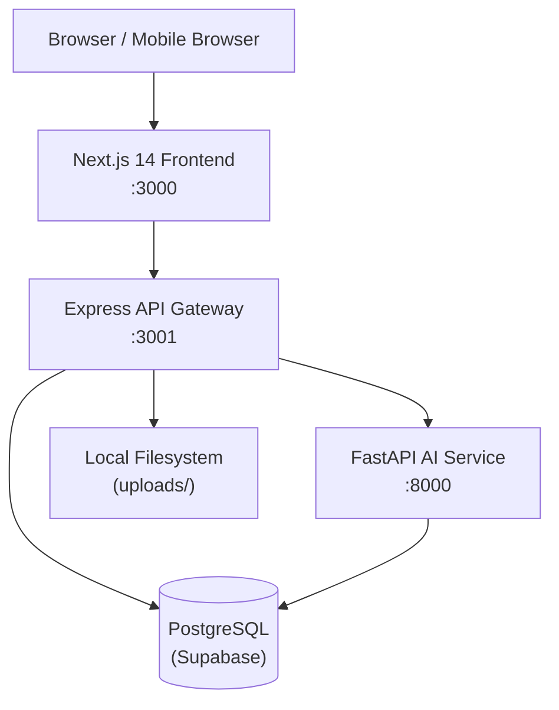

# Design Document — Oakit Platform Phase 2

## Overview

Phase 2 extends Oakit.ai from a curriculum-ingestion and day-planning tool into a full school operations platform. The additions span authentication hardening (mobile-number login, forced password reset, security-question recovery), student lifecycle management (Excel import, photo upload, permission-gated creation), daily attendance with parent-facing absence summaries, a Teacher AI UX overhaul, daily completion submission, and PDF export of day plans.

The system retains its existing three-tier architecture:

- **Frontend** — Next.js 14 + Tailwind CSS (`oakit/apps/frontend`)
- **API Gateway** — Node.js + Express + TypeScript (`oakit/apps/api-gateway`)
- **AI Service** — Python FastAPI (`oakit/apps/ai-service`)
- **Database** — PostgreSQL via Supabase (asyncpg / pg Pool)

No Redis is available; session state is JWT-only. No new infrastructure is introduced.

---

## Architecture



### Key Architectural Decisions

**Progress feedback via polling** — The existing `GET /api/v1/admin/curriculum/:id/status` endpoint already supports polling. Phase 2 enriches the `status` field with a `stage` label (`extracting`, `chunking`, `embedding`) updated by the AI service. The frontend polls every 2 s and maps stage → progress percentage. SSE is not introduced to avoid infrastructure changes.

**Holiday storage** — The existing `school_calendar.holidays DATE[]` column is replaced by a dedicated `holidays` table to support named holidays, per-holiday deletion, and import tracking. The planner service is updated to query this table.

**PDF generation** — Day planner PDFs are generated in the AI service using `reportlab` (already a Python dependency candidate). The API gateway proxies the binary response to the browser.

**Excel import** — Both holiday and student imports use `openpyxl` in the AI service (Python). The API gateway streams the uploaded file to the AI service via multipart form.

**Parent role** — A `parent_users` table links a parent mobile to one or more students. Parent login uses the same mobile-number auth flow as other roles.

---

## Components and Interfaces

### API Gateway — New and Modified Routes

#### Auth (`/api/v1/auth`)

| Method | Path | Description |
|--------|------|-------------|
| POST | `/login` | Accept `mobile` instead of `email`; return `force_password_reset` flag |
| POST | `/change-password` | Authenticated; enforce new ≠ mobile |
| POST | `/setup-security-question` | Store hashed answer after first-login reset |
| GET | `/security-questions` | Return list of ≥ 5 questions |
| POST | `/forgot-password/init` | Return user's security question by mobile + school |
| POST | `/forgot-password/verify` | Verify answer hash; return reset token |
| POST | `/forgot-password/reset` | Set new password using reset token |

#### Admin — Classes (`/api/v1/admin/classes`)

| Method | Path | Description |
|--------|------|-------------|
| POST | `/sections/:id/class-teacher` | Assign class teacher (uniqueness enforced) |
| DELETE | `/sections/:id/class-teacher` | Remove class teacher designation |

#### Admin — Calendar (`/api/v1/admin/calendar`)

| Method | Path | Description |
|--------|------|-------------|
| GET | `/academic-years` | Return next 10 academic years from current year |
| GET | `/:year/holidays` | List holidays for academic year, sorted by date |
| POST | `/:year/holidays` | Add single holiday |
| DELETE | `/:year/holidays/:id` | Delete holiday |
| POST | `/:year/holidays/import` | Upload xlsx, parse, bulk-insert holidays |

#### Admin — Students (`/api/v1/admin/students`)

| Method | Path | Description |
|--------|------|-------------|
| GET | `/` | List students (filterable by class/section) |
| POST | `/import` | Upload student xlsx, create records |
| GET | `/import/template` | Download template xlsx |
| POST | `/:id/photo` | Upload student photo (JPEG/PNG ≤ 5 MB) |
| GET | `/:id` | Student detail with photo URL |

#### Teacher — Attendance (`/api/v1/teacher/attendance`)

| Method | Path | Description |
|--------|------|-------------|
| GET | `/today` | List students in teacher's section with today's attendance status |
| POST | `/today` | Submit/update attendance for today |
| GET | `/:date` | Fetch attendance for a specific date (edit window check) |

#### Teacher — Completion (`/api/v1/teacher/completion`)

| Method | Path | Description |
|--------|------|-------------|
| POST | `/` | Submit daily completion (chunk IDs covered) |
| PUT | `/:id` | Edit completion within 24 h |
| GET | `/pending` | List uncovered chunks from prior days |

#### Teacher — PDF Export (`/api/v1/teacher/export`)

| Method | Path | Description |
|--------|------|-------------|
| GET | `/pdf?date=YYYY-MM-DD&days=1` | Generate and stream day planner PDF (days 1–7) |

#### Parent (`/api/v1/parent`)

| Method | Path | Description |
|--------|------|-------------|
| GET | `/absences` | List absence dates with covered chunks |
| POST | `/missed-topics/:id/done` | Mark missed topic task as done |
| GET | `/missed-topics/completed` | List completed missed-topic tasks |

#### AI Service — New Internal Endpoints

| Method | Path | Description |
|--------|------|-------------|
| POST | `/internal/import-holidays` | Parse xlsx, return holiday rows |
| POST | `/internal/import-students` | Parse xlsx, return student rows |
| POST | `/internal/export-pdf` | Generate day planner PDF, return binary |
| GET | `/internal/greeting` | Return contextual greeting + thought for day |

---

## Data Models

### Migration 007 — Auth Changes

```sql
-- Replace email with mobile on users table
ALTER TABLE users
  DROP COLUMN email,
  ADD COLUMN mobile          TEXT NOT NULL DEFAULT '',
  ADD COLUMN force_password_reset BOOLEAN NOT NULL DEFAULT false,
  ADD COLUMN security_question_id UUID,
  ADD COLUMN security_answer_hash TEXT;

-- Unique mobile per school (replaces old UNIQUE on email)
ALTER TABLE users ADD CONSTRAINT users_school_mobile_unique UNIQUE (school_id, mobile);
CREATE INDEX ON users(school_id, mobile);

-- Security questions lookup table
CREATE TABLE security_questions (
  id    UUID PRIMARY KEY DEFAULT gen_random_uuid(),
  text  TEXT NOT NULL UNIQUE
);

-- Seed at least 5 questions
INSERT INTO security_questions (text) VALUES
  ('What is the name of your first pet?'),
  ('What city were you born in?'),
  ('What is your mother''s maiden name?'),
  ('What was the name of your first school?'),
  ('What is your favourite childhood book?');

ALTER TABLE users
  ADD CONSTRAINT fk_security_question
  FOREIGN KEY (security_question_id) REFERENCES security_questions(id);
```

### Migration 008 — Class Teacher

```sql
-- Add class_teacher_id to sections (nullable, at most one per section)
ALTER TABLE sections
  ADD COLUMN class_teacher_id UUID REFERENCES users(id) ON DELETE SET NULL;

-- Enforce uniqueness: a teacher can be class_teacher for at most one section per school
CREATE UNIQUE INDEX sections_class_teacher_school_unique
  ON sections (class_teacher_id, school_id)
  WHERE class_teacher_id IS NOT NULL;
```

### Migration 009 — Holidays Table

```sql
-- Replace holidays DATE[] on school_calendar with a dedicated table
CREATE TABLE holidays (
  id            UUID PRIMARY KEY DEFAULT gen_random_uuid(),
  school_id     UUID NOT NULL REFERENCES schools(id) ON DELETE CASCADE,
  academic_year TEXT NOT NULL,
  holiday_date  DATE NOT NULL,
  event_name    TEXT NOT NULL,
  created_at    TIMESTAMPTZ DEFAULT now(),
  UNIQUE (school_id, academic_year, holiday_date)
);

CREATE INDEX ON holidays(school_id, academic_year, holiday_date);

-- Remove old column (data migration: expand existing DATE[] into rows)
-- Run after data migration script
ALTER TABLE school_calendar DROP COLUMN holidays;
```

### Migration 010 — Students and Attendance

```sql
CREATE TABLE students (
  id              UUID PRIMARY KEY DEFAULT gen_random_uuid(),
  school_id       UUID NOT NULL REFERENCES schools(id) ON DELETE CASCADE,
  class_id        UUID NOT NULL REFERENCES classes(id),
  section_id      UUID NOT NULL REFERENCES sections(id),
  name            TEXT NOT NULL,
  father_name     TEXT,
  parent_contact  TEXT,
  photo_path      TEXT,
  is_active       BOOLEAN NOT NULL DEFAULT true,
  created_at      TIMESTAMPTZ DEFAULT now()
);

CREATE INDEX ON students(school_id, section_id);
CREATE INDEX ON students(school_id, class_id);

CREATE TABLE attendance_records (
  id          UUID PRIMARY KEY DEFAULT gen_random_uuid(),
  school_id   UUID NOT NULL REFERENCES schools(id) ON DELETE CASCADE,
  section_id  UUID NOT NULL REFERENCES sections(id),
  student_id  UUID NOT NULL REFERENCES students(id),
  teacher_id  UUID NOT NULL REFERENCES users(id),
  attend_date DATE NOT NULL,
  status      TEXT NOT NULL CHECK (status IN ('present', 'absent')),
  submitted_at TIMESTAMPTZ DEFAULT now(),
  UNIQUE (section_id, student_id, attend_date)
);

CREATE INDEX ON attendance_records(section_id, attend_date);
CREATE INDEX ON attendance_records(student_id, attend_date);
```

### Migration 011 — Parent Users and Completion

```sql
CREATE TABLE parent_users (
  id          UUID PRIMARY KEY DEFAULT gen_random_uuid(),
  school_id   UUID NOT NULL REFERENCES schools(id) ON DELETE CASCADE,
  mobile      TEXT NOT NULL,
  name        TEXT,
  password_hash TEXT,
  force_password_reset BOOLEAN NOT NULL DEFAULT true,
  security_question_id UUID REFERENCES security_questions(id),
  security_answer_hash TEXT,
  is_active   BOOLEAN NOT NULL DEFAULT true,
  created_at  TIMESTAMPTZ DEFAULT now(),
  UNIQUE (school_id, mobile)
);

CREATE TABLE parent_student_links (
  parent_id   UUID NOT NULL REFERENCES parent_users(id) ON DELETE CASCADE,
  student_id  UUID NOT NULL REFERENCES students(id) ON DELETE CASCADE,
  PRIMARY KEY (parent_id, student_id)
);

-- Daily completion replaces free-text coverage_logs for chunk-level tracking
CREATE TABLE daily_completions (
  id              UUID PRIMARY KEY DEFAULT gen_random_uuid(),
  school_id       UUID NOT NULL REFERENCES schools(id) ON DELETE CASCADE,
  section_id      UUID NOT NULL REFERENCES sections(id),
  teacher_id      UUID NOT NULL REFERENCES users(id),
  completion_date DATE NOT NULL,
  covered_chunk_ids UUID[] NOT NULL DEFAULT '{}',
  submitted_at    TIMESTAMPTZ DEFAULT now(),
  edited_at       TIMESTAMPTZ,
  UNIQUE (section_id, completion_date)
);

CREATE INDEX ON daily_completions(section_id, completion_date);

-- Missed topic task tracking for parents
CREATE TABLE missed_topic_tasks (
  id              UUID PRIMARY KEY DEFAULT gen_random_uuid(),
  parent_id       UUID NOT NULL REFERENCES parent_users(id) ON DELETE CASCADE,
  student_id      UUID NOT NULL REFERENCES students(id),
  chunk_id        UUID NOT NULL REFERENCES curriculum_chunks(id),
  absence_date    DATE NOT NULL,
  is_done         BOOLEAN NOT NULL DEFAULT false,
  done_at         TIMESTAMPTZ,
  UNIQUE (parent_id, student_id, chunk_id, absence_date)
);

CREATE INDEX ON missed_topic_tasks(parent_id, is_done);
```

### Migration 012 — Ingestion Stage Tracking

```sql
-- Add stage column to curriculum_documents for progress feedback
ALTER TABLE curriculum_documents
  ADD COLUMN ingestion_stage TEXT DEFAULT NULL;
-- Values: NULL (pending), 'extracting', 'chunking', 'embedding', 'done', 'failed'
```

---

## Correctness Properties

*A property is a characteristic or behavior that should hold true across all valid executions of a system — essentially, a formal statement about what the system should do. Properties serve as the bridge between human-readable specifications and machine-verifiable correctness guarantees.*

### Property 1: Mobile number is the unique login identifier per school

*For any* school and any two distinct users in that school, their mobile numbers must differ. Attempting to create a second user with the same mobile in the same school must fail. The same mobile may exist in two different schools without conflict.

**Validates: Requirements 1.1, 1.6**

---

### Property 2: Initial password equals mobile number (round-trip)

*For any* newly created user, logging in with the user's mobile number as the password must succeed, and the login response must include `force_password_reset: true`.

**Validates: Requirements 1.2, 1.3**

---

### Property 3: Forced reset blocks all other endpoints

*For any* JWT issued to a user with `force_password_reset: true`, every API endpoint except `POST /auth/change-password` must return HTTP 403.

**Validates: Requirements 1.4**

---

### Property 4: New password must differ from mobile number

*For any* user undergoing a forced password reset, submitting the user's mobile number as the new password must be rejected with a validation error.

**Validates: Requirements 1.5**

---

### Property 5: Security question answer is stored as a one-way hash

*For any* user who sets a security question answer, the value stored in `users.security_answer_hash` must not equal the plaintext answer, and verifying the correct plaintext answer against the hash must return true.

**Validates: Requirements 2.3, 2.6**

---

### Property 6: Forgot-password flow returns the user's own question

*For any* user who has set a security question, calling `POST /auth/forgot-password/init` with that user's mobile and school must return exactly the question text associated with that user's `security_question_id`.

**Validates: Requirements 2.5**

---

### Property 7: Class teacher uniqueness per school

*For any* teacher already designated as `class_teacher_id` for section A in school S, attempting to designate the same teacher as `class_teacher_id` for any other section in school S must be rejected, and the error response must identify section A.

**Validates: Requirements 3.1, 3.2, 3.3**

---

### Property 8: Removing class teacher designation preserves teacher account

*For any* section with a class teacher assigned, removing the designation (setting `class_teacher_id = NULL`) must leave the teacher's user record and all their `teacher_sections` assignments intact.

**Validates: Requirements 3.4**

---

### Property 9: Ingestion status transitions are monotonically forward

*For any* curriculum document, the `status` field must only transition in the order: `pending` → `processing` → `ready` or `failed`. The `ingestion_stage` field must progress through `extracting` → `chunking` → `embedding` → `done` (or stop at `failed`) and never regress.

**Validates: Requirements 4.2, 4.3**

---

### Property 10: Academic year dropdown always covers exactly 10 years from current year

*For any* current calendar year Y, the `GET /api/v1/admin/calendar/academic-years` endpoint must return exactly 10 entries, where entry i is formatted as `(Y+i)-(YY+i+1)` (e.g., for Y=2025: `2025-26`, `2026-27`, …, `2034-35`).

**Validates: Requirements 5.1, 5.3**

---

### Property 11: Holiday add/delete round-trip

*For any* holiday added to a school calendar, it must appear in the `GET /:year/holidays` response sorted by date. After deletion, it must no longer appear.

**Validates: Requirements 6.1, 6.2, 6.9**

---

### Property 12: Holiday import skips invalid rows and reports them

*For any* xlsx file where some rows have valid date+event_name and some rows have unparseable dates, the import must create holidays only for valid rows, and the response must list each skipped row with a reason. The count of created holidays plus skipped rows must equal the total non-header rows in the file.

**Validates: Requirements 6.3, 6.4, 6.5, 6.6**

---

### Property 13: Day plans never fall on holidays

*For any* school calendar with a set of holidays H, all `plan_date` values in `day_plans` for that school must not be members of H. When a new holiday is added for a date that already has a day plan, that plan must be removed and its chunks prepended to the next non-holiday working day's plan.

**Validates: Requirements 6.7, 6.8**

---

### Property 14: Student import validates columns before processing rows

*For any* xlsx file missing one or more of the required columns (`student name`, `father name`, `section`, `class`, `parent contact number`), the import endpoint must return an error listing the missing columns without creating any student records.

**Validates: Requirements 7.2, 7.3**

---

### Property 15: Student import round-trip with partial failure

*For any* valid student xlsx where some rows reference non-existent classes or sections, the import must create student records only for valid rows, and the response must include counts of created and skipped rows. Querying students for a valid section must return exactly the students from valid rows for that section.

**Validates: Requirements 7.1, 7.4, 7.5, 7.6**

---

### Property 16: Student photo upload round-trip with format/size enforcement

*For any* JPEG or PNG file ≤ 5 MB, uploading it for a student must succeed and the student detail response must include a non-null `photo_url`. For any file > 5 MB or not JPEG/PNG, the upload must be rejected with a descriptive error.

**Validates: Requirements 8.1, 8.2, 8.3, 8.4**

---

### Property 17: Permission guard on student creation

*For any* user whose role does not include the `create_students` permission, calling `POST /api/v1/admin/students/import` or creating a student must return HTTP 403. After granting the permission to the role, the same user must be able to create students.

**Validates: Requirements 9.1, 9.2, 9.3, 9.4**

---

### Property 18: Attendance records are unique per student per date per section

*For any* section, student, and date, there must be at most one attendance record. Submitting attendance twice for the same student on the same date must update the existing record, not create a duplicate. Submitting for a date after midnight of that day must be rejected.

**Validates: Requirements 10.1, 10.3, 10.4, 10.6**

---

### Property 19: Holiday attendance requires confirmation

*For any* holiday date, submitting attendance without an explicit `confirm_holiday: true` flag must return a warning response (HTTP 200 with `warning` field or HTTP 409) rather than saving records.

**Validates: Requirements 10.5**

---

### Property 20: Parent absence view includes student name and covered chunks

*For any* parent whose child has at least one absence record, the `GET /api/v1/parent/absences` response must include the student's name in every absence entry, and each entry must list the `curriculum_chunks` covered on that date (from `daily_completions`).

**Validates: Requirements 11.1, 11.5**

---

### Property 21: Missed topic task completion round-trip

*For any* missed topic task, marking it as done must remove it from the active missed-topics list and add it to the completed list. The union of active and completed tasks must equal the original full set of tasks.

**Validates: Requirements 11.3, 11.4**

---

### Property 22: Contextual greeting matches time bucket

*For any* login timestamp T, the greeting returned by `GET /internal/greeting` must satisfy: `"Good morning"` if 05:00 ≤ T < 12:00, `"Good afternoon"` if 12:00 ≤ T < 17:00, `"Good evening"` otherwise. If T is before the school's configured start time, the response must also include the early-arrival acknowledgement message.

**Validates: Requirements 12.1, 12.4**

---

### Property 23: Thought for the day does not repeat on consecutive days

*For any* teacher who logs in on two consecutive calendar days, the `thought_for_day` value in the two responses must differ.

**Validates: Requirements 12.3**

---

### Property 24: Attendance prompt appears iff attendance is missing during school hours

*For any* teacher login, the `attendance_prompt` flag in the login context must be `true` if and only if: (a) the current time is within school hours AND (b) no attendance record exists for the teacher's section for today. If attendance has already been submitted, the flag must be `false` regardless of time.

**Validates: Requirements 13.1, 13.3, 13.4**

---

### Property 25: AI query scope is restricted to today's plan chunks plus carried-forward chunks

*For any* teacher query, the set of chunk IDs used as context by the AI must be exactly the union of today's `day_plans.chunk_ids` and any chunks carried forward from prior days. Chunks from other dates or other sections must not appear in the context.

**Validates: Requirements 14.1, 14.3**

---

### Property 26: Pending work list is sorted oldest-first and clears when fully covered

*For any* teacher, the `GET /api/v1/teacher/completion/pending` response must list uncovered chunks from prior day plans sorted by `plan_date` ascending. After all chunks for a given prior day are included in a `daily_completions` record, that day must no longer appear in the pending list.

**Validates: Requirements 15.1, 15.2, 15.3**

---

### Property 27: Daily completion is unique per section per day with 24-hour edit window

*For any* section and calendar date, there must be at most one `daily_completions` record. Submitting a second completion for the same section/date must update the existing record. Editing a completion more than 24 hours after `submitted_at` must be rejected.

**Validates: Requirements 16.1, 16.2, 16.4**

---

### Property 28: Completed topics are visible to parents

*For any* `daily_completions` record, the chunks listed in `covered_chunk_ids` must appear in the parent's absence view for the corresponding date when the parent's child was absent on that date.

**Validates: Requirements 16.3**

---

### Property 29: Day planner PDF contains required fields and watermark on every page

*For any* generated Day_Planner_PDF, parsing the PDF must reveal: the teacher's name, section label, date or date range, and all topic labels from the day plan. Every page of the PDF must contain the watermark text.

**Validates: Requirements 17.2, 17.3**

---

## Error Handling

| Scenario | HTTP Status | Response |
|----------|-------------|----------|
| Invalid mobile format | 400 | `{ error: "Mobile number must be 10 digits" }` |
| Wrong credentials (any field) | 401 | `{ error: "Invalid credentials" }` (never reveals which field) |
| Force-reset token used on non-change-password endpoint | 403 | `{ error: "Password change required", force_password_reset: true }` |
| Wrong security question answer | 401 | `{ error: "Incorrect answer" }` |
| Class teacher conflict | 409 | `{ error: "Teacher is already class teacher for section X", conflicting_section: { id, label } }` |
| Duplicate attendance record | 200 (upsert) | Updated record returned |
| Attendance on holiday without confirmation | 409 | `{ warning: "Date is a holiday", holiday_name: "..." }` |
| Student xlsx missing columns | 400 | `{ error: "Missing columns", missing: ["section", ...] }` |
| Photo too large or wrong format | 400 | `{ error: "Photo must be JPEG or PNG and under 5 MB" }` |
| No day plan for PDF export | 404 | `{ error: "No day plan found for the requested date range" }` |
| Ingestion failure | 500 (AI service) | `curriculum_documents.status = 'failed'`, `ingestion_stage = 'failed'` |
| Edit completion after 24 h | 403 | `{ error: "Edit window has closed" }` |

---

## Testing Strategy

### Dual Testing Approach

Both unit tests and property-based tests are required. Unit tests cover specific examples, integration points, and edge cases. Property-based tests verify universal correctness across randomised inputs.

### Unit Tests

- Auth flow: login with mobile, forced reset redirect, security question setup and verify
- Holiday import: valid xlsx, xlsx with invalid dates, xlsx missing columns
- Student import: valid xlsx, missing columns, invalid class/section references
- Attendance: submit, upsert on re-submit, reject after midnight, holiday warning
- PDF export: single day with plan, week range, no plan returns 404
- Academic year generation: current year = 2025 → list starts with "2025-26"
- Greeting: morning/afternoon/evening/early-arrival cases

### Property-Based Tests

Use **fast-check** (TypeScript, API Gateway) and **Hypothesis** (Python, AI Service).

Each property test must run a minimum of **100 iterations**.

Tag format: `// Feature: oakit-platform-phase2, Property N: <property_text>`

| Property | Test Location | Library | Description |
|----------|--------------|---------|-------------|
| P1 | api-gateway | fast-check | Mobile uniqueness per school |
| P2 | api-gateway | fast-check | Initial password = mobile round-trip |
| P3 | api-gateway | fast-check | Force-reset JWT blocks all endpoints |
| P4 | api-gateway | fast-check | New password ≠ mobile |
| P5 | api-gateway | fast-check | Security answer hash is one-way |
| P6 | api-gateway | fast-check | Forgot-password returns correct question |
| P7 | api-gateway | fast-check | Class teacher uniqueness |
| P8 | api-gateway | fast-check | Remove class teacher preserves account |
| P9 | ai-service | Hypothesis | Ingestion stage monotonic progression |
| P10 | api-gateway | fast-check | Academic year list = 10 entries from current year |
| P11 | api-gateway | fast-check | Holiday add/delete round-trip |
| P12 | ai-service | Hypothesis | Holiday import skips invalid rows |
| P13 | ai-service | Hypothesis | Day plans never on holidays |
| P14 | ai-service | Hypothesis | Student import column validation |
| P15 | ai-service | Hypothesis | Student import partial failure round-trip |
| P16 | api-gateway | fast-check | Photo upload format/size enforcement |
| P17 | api-gateway | fast-check | Permission guard on student creation |
| P18 | api-gateway | fast-check | Attendance uniqueness and edit window |
| P19 | api-gateway | fast-check | Holiday attendance requires confirmation |
| P20 | api-gateway | fast-check | Parent absence view completeness |
| P21 | api-gateway | fast-check | Missed topic task completion round-trip |
| P22 | ai-service | Hypothesis | Greeting time bucket correctness |
| P23 | ai-service | Hypothesis | Thought for day non-repetition |
| P24 | api-gateway | fast-check | Attendance prompt logic |
| P25 | ai-service | Hypothesis | AI query scope restriction |
| P26 | api-gateway | fast-check | Pending work sorted and clears |
| P27 | api-gateway | fast-check | Completion uniqueness and edit window |
| P28 | api-gateway | fast-check | Completed topics visible to parents |
| P29 | ai-service | Hypothesis | PDF watermark and required fields |

### Frontend Pages and Components

New pages to add:

| Route | Description |
|-------|-------------|
| `/login` | Updated: mobile field, "Forgot Password" link |
| `/auth/change-password` | Forced reset + security question setup |
| `/auth/forgot-password` | Security question flow |
| `/admin/students` | Student list, import, photo upload |
| `/admin/calendar` | Updated: year dropdown, holiday management, xlsx import |
| `/teacher/attendance` | Mobile-optimised attendance marking |
| `/teacher` | Updated: contextual greeting, thought for day, pending work, PDF export button |
| `/parent` | Absence list, missed topics, mark-as-done |

New shared components:

- `ProgressBar` — upload + ingestion progress with stage label
- `AcademicYearSelect` — dropdown auto-populated with 10 years
- `HolidayImportModal` — xlsx upload + import summary
- `StudentImportModal` — xlsx upload + import summary
- `AttendanceRow` — mobile-optimised present/absent toggle
- `PendingWorkList` — sorted list of uncovered prior chunks
- `MissedTopicCard` — parent-facing absence + topic list + mark-done
