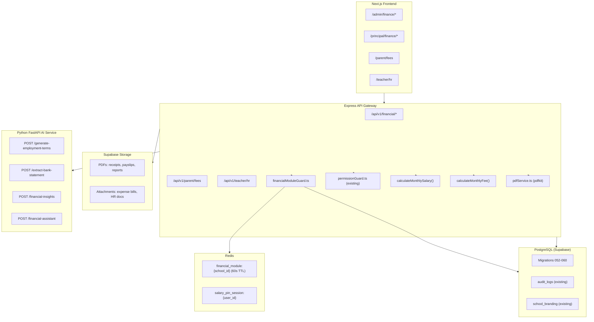

# School Financial Module — Design Document

## Overview

The School Financial Module is a comprehensive, multi-tenant financial management system built on top of the existing Oakit SaaS platform. It covers the full lifecycle of school finances: student enquiry and admission with automatic fee assignment, fee collection and reconciliation, expense management, staff salary processing with payslip generation, HR document management, and financial reporting with AI-powered insights.

The module is controlled at the Super Admin level and can be enabled or disabled per school or franchise. Access to financial data is strictly role-gated using the existing RBAC system, with the Principal holding the highest level of access within a school.

### Key Design Principles

1. **School isolation first** — every query is scoped by `school_id`; no cross-school data leakage is possible at the query layer.
2. **Soft-delete everywhere** — no financial record is ever hard-deleted; `deleted_at` timestamps preserve the audit trail.
3. **Permission-first API** — every route checks permissions independently of UI visibility; a 403 is returned before any data is touched.
4. **Extend, don't replace** — the module reuses existing middleware (`jwtVerify`, `roleGuard`, `permissionGuard`, `schoolScope`), the existing `audit_logs` table, and the existing Supabase Storage pattern.
5. **PDF generation via pdfkit** — lightweight, server-side, no headless browser required.
6. **AI via existing service** — all AI calls go through the existing Python FastAPI `ai-service` at `AI_SERVICE_URL`.

### Tech Stack (existing, unchanged)

| Layer | Technology |
|---|---|
| Backend | Node.js + Express + TypeScript (`oakit/apps/api-gateway`) |
| Frontend | Next.js 14 App Router + React 18 + Tailwind CSS + SWR |
| Database | PostgreSQL via `pg` Pool (Supabase-hosted) |
| Auth | JWT (`jsonwebtoken`), Redis token revocation |
| File Storage | Supabase Storage (existing `storage.ts` pattern) |
| PDF Generation | `pdfkit` (new dependency, server-side) |
| AI | Existing Python FastAPI `ai-service`, called via HTTP |
| Property Testing | `fast-check` (already in `devDependencies`) |

---

## Architecture

### High-Level Component Diagram



### Request Flow

Every financial API request passes through this middleware chain:

```
jwtVerify  forceResetGuard  schoolScope  financialModuleGuard  permissionGuard(PERMISSION)  route handler
```

---

## Components and Interfaces

### 1. Financial Module Guard Middleware

**File:** `oakit/apps/api-gateway/src/middleware/financialModuleGuard.ts`

```typescript
import { Request, Response, NextFunction } from 'express';
import { pool } from '../lib/db';
import { redis } from '../lib/redis';

export function financialModuleGuard(req: Request, res: Response, next: NextFunction) {
  return async () => {
    const schoolId = req.user?.school_id;
    if (!schoolId) return next(); // super_admin / franchise_admin bypass

    const cacheKey = `financial_module:${schoolId}`;
    const cached = await redis.get(cacheKey);

    let isEnabled: boolean;
    if (cached !== null) {
      isEnabled = cached === '1';
    } else {
      const row = await pool.query(
        'SELECT is_enabled FROM financial_module_settings WHERE school_id = $1',
        [schoolId]
      );
      isEnabled = row.rows.length === 0 || row.rows[0].is_enabled === true;
      await redis.setEx(cacheKey, 60, isEnabled ? '1' : '0');
    }

    if (!isEnabled) {
      return res.status(403).json({
        error: 'Financial module is not enabled for this school. Contact your administrator.',
        code: 'FINANCIAL_MODULE_DISABLED',
      });
    }
    return next();
  };
}
```

### 2. Permission Constants

**File:** `oakit/apps/api-gateway/src/lib/permissions.ts`

```typescript
export const PERMISSIONS = {
  VIEW_SALARY:              'VIEW_SALARY',
  EDIT_SALARY:              'EDIT_SALARY',
  VIEW_EXPENSE:             'VIEW_EXPENSE',
  ADD_EXPENSE:              'ADD_EXPENSE',
  VIEW_PROFIT:              'VIEW_PROFIT',
  VIEW_FEES:                'VIEW_FEES',
  COLLECT_PAYMENT:          'COLLECT_PAYMENT',
  MANAGE_CONCESSION:        'MANAGE_CONCESSION',
  VIEW_RECONCILIATION:      'VIEW_RECONCILIATION',
  PERFORM_RECONCILIATION:   'PERFORM_RECONCILIATION',
  VIEW_REPORTS:             'VIEW_REPORTS',
  SEND_REMINDER:            'SEND_REMINDER',
  PUSH_PAYSLIP:             'PUSH_PAYSLIP',
  MANAGE_ATTENDANCE:        'MANAGE_ATTENDANCE',
  MANAGE_HR:                'MANAGE_HR',
  APPROVE_TERMINATION:      'APPROVE_TERMINATION',
} as const;

export type Permission = typeof PERMISSIONS[keyof typeof PERMISSIONS];

/** Default permission sets applied at role creation */
export const DEFAULT_ROLE_PERMISSIONS: Record<string, Permission[]> = {
  principal:       Object.values(PERMISSIONS) as Permission[],
  admin:           ['VIEW_FEES', 'COLLECT_PAYMENT', 'VIEW_RECONCILIATION', 'PERFORM_RECONCILIATION', 'VIEW_REPORTS', 'SEND_REMINDER'],
  finance_manager: ['VIEW_FEES', 'COLLECT_PAYMENT', 'VIEW_RECONCILIATION', 'VIEW_REPORTS'],
  teacher:         [],
  parent:          ['VIEW_FEES'],
};
```

### 3. Fee Calculation Engine

**File:** `oakit/apps/api-gateway/src/lib/feeCalculation.ts`

```typescript
export type BillingBasis = 'per_hour' | 'per_day' | 'per_week' | 'per_month_flat';

export interface FeeCalculationInput {
  billing_basis: BillingBasis;
  rate: number;
  hours_per_day?: number;   // required for per_hour
  days_per_week?: number;   // required for per_hour and per_day
}

export interface FeeCalculationResult {
  calculated_monthly_fee: number;
  formula_description: string;
}

const WEEKS_PER_MONTH = 4.33;

export function calculateMonthlyFee(input: FeeCalculationInput): FeeCalculationResult {
  const { billing_basis, rate, hours_per_day = 0, days_per_week = 0 } = input;

  switch (billing_basis) {
    case 'per_hour':
      return {
        calculated_monthly_fee: rate * hours_per_day * days_per_week * WEEKS_PER_MONTH,
        formula_description: `${rate}  ${hours_per_day}h/day  ${days_per_week}d/week  4.33`,
      };
    case 'per_day':
      return {
        calculated_monthly_fee: rate * days_per_week * WEEKS_PER_MONTH,
        formula_description: `${rate}  ${days_per_week}d/week  4.33`,
      };
    case 'per_week':
      return {
        calculated_monthly_fee: rate * WEEKS_PER_MONTH,
        formula_description: `${rate}  4.33`,
      };
    case 'per_month_flat':
      return {
        calculated_monthly_fee: rate,
        formula_description: `flat ${rate}/month`,
      };
  }
}
```

### 4. Salary Calculation Engine

**File:** `oakit/apps/api-gateway/src/lib/salaryCalculation.ts`

```typescript
export type SalaryCalculationMethod = 'weekday_count' | 'calendar_days' | 'custom_working_days';
export type DeductionChoice = 'deduct' | 'pay_full';

export interface SalaryCalculationInput {
  gross_salary: number;
  present_days: number;
  absent_days: number;
  leave_days: number;
  working_days: number;           // denominator (from monthly_working_days table)
  deduction_choice: DeductionChoice;
  override_amount?: number | null; // Principal override
}

export interface SalaryCalculationResult {
  per_day_rate: number;
  deduction_amount: number;
  net_salary: number;
}

export function calculateMonthlySalary(input: SalaryCalculationInput): SalaryCalculationResult {
  const { gross_salary, absent_days, working_days, deduction_choice, override_amount } = input;

  const per_day_rate = working_days > 0 ? gross_salary / working_days : 0;
  const deduction_amount = deduction_choice === 'deduct'
    ? Math.max(0, absent_days * per_day_rate)
    : 0;
  const calculated_net = Math.max(0, gross_salary - deduction_amount);
  const net_salary = override_amount != null ? Math.max(0, override_amount) : calculated_net;

  return { per_day_rate, deduction_amount, net_salary };
}
```

### 5. PDF Service

**File:** `oakit/apps/api-gateway/src/lib/pdfService.ts`

Wraps `pdfkit` to generate branded PDFs. All PDF generators accept a `BrandingContext` (school logo URL, name, address from `school_branding` table) and a `GeneratorContext` (actor name, role, page metadata).

```typescript
export interface BrandingContext {
  school_name: string;
  school_address: string;
  logo_url: string | null;  // null  use default Oakit placeholder
}

export interface GeneratorContext {
  generated_by_name: string;
  generated_by_role: string;
  generated_at: Date;
}

// Exported generators:
export async function generateReceiptPDF(data: ReceiptData, branding: BrandingContext, ctx: GeneratorContext): Promise<Buffer>
export async function generatePayslipPDF(data: PayslipData, branding: BrandingContext, ctx: GeneratorContext): Promise<Buffer>
export async function generateReportPDF(data: ReportData, branding: BrandingContext, ctx: GeneratorContext): Promise<Buffer>
export async function generateOfferLetterPDF(data: OfferLetterData, branding: BrandingContext, ctx: GeneratorContext): Promise<Buffer>
export async function generateExperienceLetterPDF(data: ExperienceLetterData, branding: BrandingContext, ctx: GeneratorContext): Promise<Buffer>
```

**Branded Report Header** (shared across all PDFs):
- Row 1: School logo (left, 6060px) | School name (center, bold 16pt) | Report title (right, 12pt)
- Row 2: School address (center, 10pt gray)
- Horizontal rule
- Footer on every page: `Generated by [name] ([role]) | Page X of Y | Generated on [date]`
- Non-refundable notice on receipts: printed in red italic below the payment summary

**Payslip Layout:**
- Header: school logo + name + address
- Staff details table: Name | Role | Employee ID | Month/Year
- Attendance summary: Working Days | Present | Absent | Leaves
- Earnings table: each Salary_Component as a row  Gross Total
- Deductions table: each deduction as a row  Total Deductions
- Net Salary (bold, highlighted box)
- Payment details: Mode | Date
- Footer: "This is a system-generated salary slip." + generation date

---
