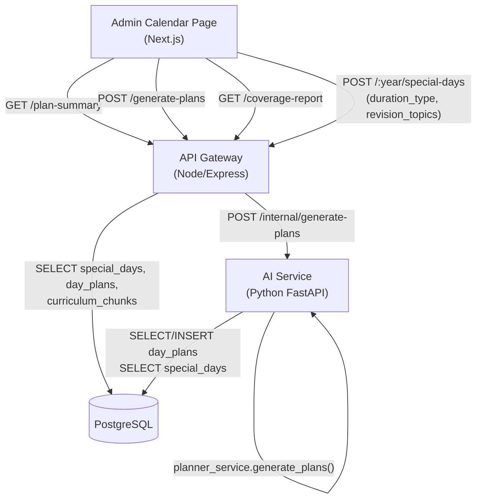

# Design Document: Smart Curriculum Planning

## Overview

Smart Curriculum Planning extends the existing Oakit plan-generation workflow with five capabilities:

1. **Pre-Generation Summary Modal** — shows chunk vs. day counts before generation
2. **Extended Event Types** — removes the hard-coded CHECK constraint and supports custom types
3. **Half-Day Event Handling** — splits chunks at midpoint; carries the second half forward
4. **Smart Revision Day Topic Tagging** — `revision_topics` column feeds AI context
5. **Post-Generation Coverage Report** — highlights cycled content and empty months

The feature touches four layers: PostgreSQL schema (migrations), Python FastAPI AI service (`planner_service.py`, `query_pipeline.py`), Node.js/TypeScript API gateway (`calendar.ts`), and the Next.js admin calendar page.

---

## Architecture



The API gateway owns all HTTP surface area. The AI service owns plan generation logic and LLM context building. The database is the single source of truth for all plan state.

---

## Components and Interfaces

### 1. Database Migration (017_smart_curriculum_planning.sql)

Alters `special_days` and `day_plans` in a single migration:

```sql
-- Drop the hard-coded CHECK on day_type
ALTER TABLE special_days DROP CONSTRAINT IF EXISTS special_days_day_type_check;

-- Add duration_type with its own CHECK
ALTER TABLE special_days
  ADD COLUMN IF NOT EXISTS duration_type TEXT NOT NULL DEFAULT 'full_day'
    CHECK (duration_type IN ('full_day', 'half_day'));

-- Add revision_topics array
ALTER TABLE special_days
  ADD COLUMN IF NOT EXISTS revision_topics TEXT[] DEFAULT '{}';

-- Add carry_forward_fragment to day_plans
ALTER TABLE day_plans
  ADD COLUMN IF NOT EXISTS carry_forward_fragment TEXT;
```

The existing `activity_note`, `start_time`, `end_time` columns (added in migrations 014–015) are unchanged.

### 2. API Gateway — New Endpoints

#### GET /api/v1/admin/calendar/plan-summary

Query params: `class_id` (required), `academic_year` (required), `month` (optional), `plan_year` (optional).

Response shape:
```typescript
{
  total_chunks: number;
  total_working_days: number;
  net_curriculum_days: number;        // working_days - full_day_specials + 0.5 * half_day_specials
  special_day_breakdown: {
    [day_type: string]: { full_day: number; half_day: number };
  };
  fit: 'exact' | 'under' | 'over';   // chunks vs net_curriculum_days
  recommendation: string;
}
```

The endpoint queries `school_calendar`, `holidays`, `special_days`, and `curriculum_chunks` directly — no AI service call needed.

#### GET /api/v1/admin/calendar/coverage-report

Query params: `class_id` (required), `section_id` (required), `academic_year` (required).

Response shape:
```typescript
{
  months: Array<{
    year: number;
    month: number;
    status: 'has_curriculum' | 'special_only' | 'no_working_days';
  }>;
  cycled_days: Array<{ date: string; chunk_ids: string[] }>;
  unique_chunks_covered: number;
  total_chunks: number;
}
```

Cycled days are detected by collecting all `chunk_ids` arrays in chronological order and flagging any date whose chunks have all appeared on an earlier date.

#### Updated POST /api/v1/admin/calendar/:year/special-days

Accepts two new optional fields: `duration_type` (`'full_day'` | `'half_day'`, default `'full_day'`) and `revision_topics` (string array, only meaningful when `day_type === 'revision'`).

Validation added:
- `day_type` must match `/^[a-zA-Z0-9_-]{1,50}$/`
- Each `revision_topics` entry must be ≤ 200 characters
- Returns HTTP 400 with a descriptive message on violation

### 3. planner_service.py — Half-Day Logic

The core change is in `generate_plans`. The existing `special_day_set` (full exclusion) is split into two sets:

```python
full_day_set  = {r["day_date"] for r in special_rows if r["duration_type"] == "full_day"}
half_day_set  = {r["day_date"] for r in special_rows if r["duration_type"] == "half_day"}
```

`all_curriculum_days` now includes half-day dates (they receive content). The chunk index advances by 0.5 for each half-day, by 1 for each full curriculum day.

Half-day splitting:
```python
def _split_chunk(content: str) -> tuple[str, str]:
    mid = len(content) // 2
    return content[:mid], content[mid:]
```

When a half-day is encountered:
1. Fetch the full chunk text for that day's assigned chunk.
2. Store the first half in `day_plans.chunk_ids` (as the original chunk UUID) and write the first-half text into a new `carry_forward_fragment` on the *current* day's plan.
3. Prepend the second-half text as `carry_forward_fragment` on the *next* working day's plan.

Cross-month carry-forward: when generating a monthly range, the service reads the `carry_forward_fragment` from the last `day_plan` of the preceding month before starting distribution.

### 4. query_pipeline.py — Revision Topics in AI Context

In `_build_day_context`, when `day_type == 'revision'` and `revision_topics` is non-empty, the context block is extended:

```python
if day_type == "revision" and special_day.get("revision_topics"):
    topics_str = ", ".join(special_day["revision_topics"])
    ctx_parts.append(f"Revision topics for today: {topics_str}")
```

The `_SPECIAL_DAY_GUIDANCE["revision"]` text is kept as the base; the topics line is appended after it. When `revision_topics` is empty or null, behaviour is unchanged.

The `special_rows` query in `generate_plans` and the `special_day` fetch in `query_pipeline` must both `SELECT revision_topics` from `special_days`.

### 5. Admin UI Changes

#### Pre-Generation Modal (`PreGenerationModal` component)

Triggered when the admin clicks "Generate Plans". Before submitting, the UI:
1. Calls `GET /plan-summary` with the current form values.
2. Renders the summary in a modal with a "Proceed" and "Cancel" button.
3. On "Proceed", fires the existing `POST /generate-plans` request.

#### Extended Event Type Selector

`DAY_TYPE_CONFIG` is extended with the new predefined types. A "Custom" option reveals a free-text input. When a predefined type is selected, the label field is pre-populated with a human-readable default.

Predefined defaults:
| day_type | Default label |
|---|---|
| settling | Settling Period |
| revision | Revision Day |
| exam | Exam Day |
| event | School Event |
| sports_day | Sports Day |
| annual_day | Annual Day |
| cultural_day | Cultural Day |
| field_trip | Field Trip |
| culminating_day | Culminating Day |
| parent_teacher_meeting | Parent-Teacher Meeting |

#### Revision Topics Input

When `day_type === 'revision'`, a tag-style multi-value input appears below the label field. Each tag is a string; pressing Enter or comma adds a tag. Tags are sent as `revision_topics: string[]` in the POST body.

#### Coverage Report Display

After `POST /generate-plans` returns success, the UI calls `GET /coverage-report` and renders:
- A month-by-month status table (green = has curriculum, amber = special only, grey = no working days)
- A list of cycled dates with a ♻️ indicator
- Suggestions if cycling occurred or if empty months exist
- A "Dismiss" button that returns to the normal calendar state

---

## Data Models

### special_days (updated)

| Column | Type | Notes |
|---|---|---|
| id | UUID | PK |
| school_id | UUID | FK schools |
| academic_year | TEXT | |
| day_date | DATE | |
| day_type | TEXT | No CHECK — validated in API layer |
| label | TEXT | |
| activity_note | TEXT | nullable |
| start_time | TIME | nullable |
| end_time | TIME | nullable |
| duration_type | TEXT | CHECK IN ('full_day','half_day'), default 'full_day' |
| revision_topics | TEXT[] | default '{}' |
| created_at | TIMESTAMPTZ | |

### day_plans (updated)

| Column | Type | Notes |
|---|---|---|
| id | UUID | PK |
| school_id | UUID | FK |
| section_id | UUID | FK |
| teacher_id | UUID | FK |
| plan_date | DATE | |
| chunk_ids | UUID[] | |
| status | TEXT | scheduled / holiday / carried_forward |
| carry_forward_fragment | TEXT | nullable — second half of a split chunk |

---

## Correctness Properties

*A property is a characteristic or behavior that should hold true across all valid executions of a system — essentially, a formal statement about what the system should do. Properties serve as the bridge between human-readable specifications and machine-verifiable correctness guarantees.*

### Property 1: Plan-summary net_curriculum_days formula

*For any* school calendar configuration with a set of working days, full-day special days, and half-day special days, the `net_curriculum_days` returned by `/plan-summary` must equal `working_days_count - full_day_count + 0.5 * half_day_count`.

**Validates: Requirements 1.2, 1.3, 1.4, 1.5**

---

### Property 2: Plan-summary fit classification

*For any* combination of `total_chunks` and `net_curriculum_days`, the `fit` field must be `'under'` when `total_chunks < net_curriculum_days`, `'over'` when `total_chunks > net_curriculum_days`, and `'exact'` when they are equal.

**Validates: Requirements 1.3, 1.4, 1.5**

---

### Property 3: day_type validation round-trip

*For any* string that matches `/^[a-zA-Z0-9_-]{1,50}$/`, POSTing it as `day_type` to the special-days endpoint and then GETting the same record must return the same `day_type` string unchanged.

**Validates: Requirements 2.1, 2.2, 2.7**

---

### Property 4: Invalid day_type rejection

*For any* string that either exceeds 50 characters or contains characters outside `[a-zA-Z0-9_-]`, the API must return HTTP 400.

**Validates: Requirements 2.8**

---

### Property 5: Half-day chunk conservation

*For any* plan generation run containing half-day special days, the total character count of content assigned across all day plans (first halves on half-days plus second halves carried to the next day) must equal the total character count of the original chunks assigned to those positions.

**Validates: Requirements 3.1, 3.2**

---

### Property 6: Half-day carry-forward round-trip

*For any* valid plan generation input containing half-day special days, reading the resulting `day_plans` and re-running generation with the same inputs must produce equivalent `chunk_ids` assignments and `carry_forward_fragment` values.

**Validates: Requirements 3.7**

---

### Property 7: Revision topics round-trip

*For any* list of revision topic strings (each ≤ 200 characters), POSTing them as `revision_topics` on a revision special day and then GETting that record must return the same ordered list.

**Validates: Requirements 4.1**

---

### Property 8: Revision topic length rejection

*For any* revision topic string exceeding 200 characters, the API must return HTTP 400.

**Validates: Requirements 4.5**

---

### Property 9: Coverage report cycled-day detection

*For any* set of day plans where a chunk UUID appears on more than one date, the coverage report must include every date after the first occurrence of that chunk in `cycled_days`.

**Validates: Requirements 5.3, 5.7**

---

### Property 10: Coverage report month status correctness

*For any* generation range, every month in the range must appear in the coverage report with the correct status: `has_curriculum` if any day plan in that month has non-empty `chunk_ids`, `special_only` if all working days are special days with empty `chunk_ids`, and `no_working_days` if no working days exist in that month.

**Validates: Requirements 5.2, 5.7**

---

## Error Handling

| Scenario | Layer | Response |
|---|---|---|
| `day_type` fails regex or length | API gateway | HTTP 400 `{ error: "day_type must be alphanumeric/underscore/hyphen, max 50 chars" }` |
| `revision_topics` entry > 200 chars | API gateway | HTTP 400 `{ error: "revision_topics entries must be ≤ 200 characters" }` |
| No school calendar configured | AI service | raises `ValueError("School calendar not configured")` → gateway returns 500 |
| Half-day carry-forward has no next working day | AI service | stores fragment in `carry_forward_fragment` with `status = 'carried_forward'`, logs warning |
| `/plan-summary` called with no curriculum chunks | API gateway | returns `{ total_chunks: 0, fit: 'under', recommendation: "No curriculum uploaded for this class." }` |
| `/coverage-report` called before any plans exist | API gateway | returns empty `months` array and `cycled_days: []` |

---

## Testing Strategy

### Unit Tests

Focus on specific examples and edge cases:

- `plan-summary` returns correct `fit` for exact/under/over cases
- `day_type` validation accepts all predefined types and rejects invalid strings
- `revision_topics` validation rejects strings > 200 chars
- `_split_chunk` splits at the character midpoint correctly for odd-length strings
- Coverage report correctly identifies a cycled day when the same chunk UUID appears twice
- Coverage report returns `special_only` for a month where all working days are special days

### Property-Based Tests

Library: **Hypothesis** (Python) for AI service logic; **fast-check** (TypeScript) for API gateway validation.

Each property test runs a minimum of 100 iterations.

**Tag format: `Feature: smart-curriculum-planning, Property {N}: {property_text}`**

| Property | Test description |
|---|---|
| P1 | Generate random calendar configs; assert `net_curriculum_days == working - full + 0.5 * half` |
| P2 | Generate random `(chunks, net_days)` pairs; assert `fit` matches the arithmetic comparison |
| P3 | Generate random valid `day_type` strings; POST then GET; assert round-trip equality |
| P4 | Generate random strings violating length or charset; assert HTTP 400 |
| P5 | Generate random chunk lists with half-day positions; assert total content length is conserved |
| P6 | Generate random plan inputs with half-days; run generation twice; assert idempotent output |
| P7 | Generate random topic lists (each ≤ 200 chars); POST then GET; assert ordered equality |
| P8 | Generate random strings > 200 chars; assert HTTP 400 |
| P9 | Generate random day-plan sequences with repeated chunk UUIDs; assert all post-first occurrences appear in `cycled_days` |
| P10 | Generate random month ranges with mixed plan states; assert every month has the correct status |

Property tests for the planner service (P5, P6) use an in-memory mock of the DB pool to avoid requiring a live database.
