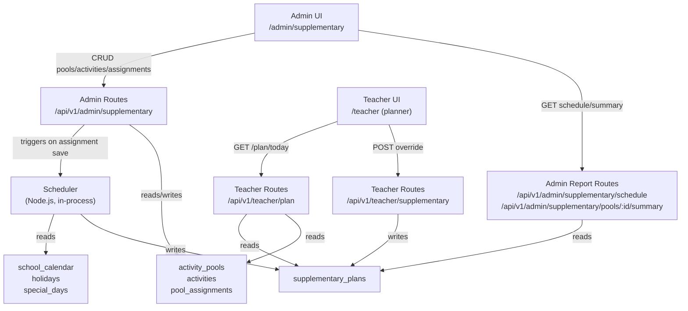
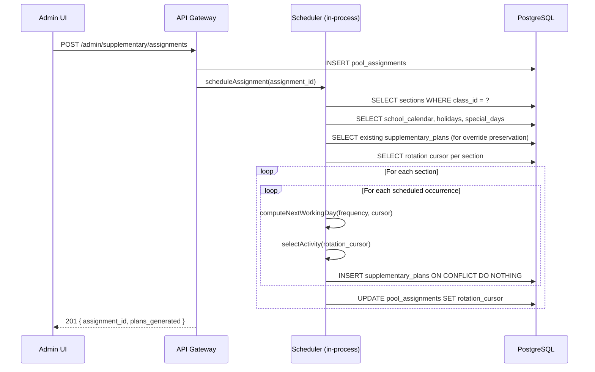
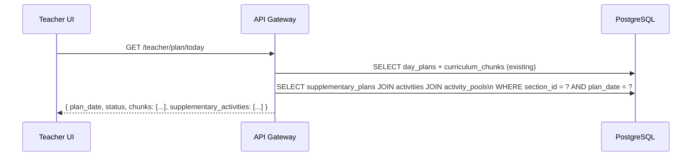
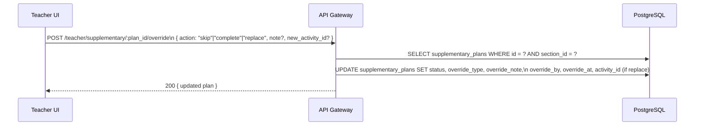

# Design Document: Supplementary Activity Pools

## Overview

Supplementary Activity Pools extends Oakit with a structured, admin-planned layer of non-curriculum learning (rhymes, public speaking, storytelling, sports, etc.). School admins define pools of activities, assign them to classes with a frequency and date range, and the system automatically distributes activities across working days. Teachers see their supplementary schedule as a dedicated section in the daily planner and can mark activities as completed, skip them, or swap them — without touching the core curriculum plan.

The feature is entirely separate from the AI-driven curriculum planner. Scheduling is deterministic and runs in the Node.js API gateway (no Python AI service involvement). The `supplementary_plans` table has no foreign-key dependency on `day_plans` or `curriculum_chunks`.

---

## Architecture



---

## Sequence Diagrams

### Admin Creates Assignment and Triggers Scheduling



### Teacher Views Daily Planner



### Teacher Submits Override



---

## Database Schema

### Migration 021: supplementary_activity_pools

```sql
-- activity_pools: named groups of supplementary activities per school
CREATE TABLE activity_pools (
    id          UUID PRIMARY KEY DEFAULT gen_random_uuid(),
    school_id   UUID NOT NULL REFERENCES schools(id) ON DELETE CASCADE,
    name        TEXT NOT NULL,
    description TEXT,
    language    TEXT NOT NULL DEFAULT 'None',
    created_at  TIMESTAMPTZ DEFAULT now(),
    UNIQUE(school_id, name)
);

-- activities: individual items within a pool
CREATE TABLE activities (
    id              UUID PRIMARY KEY DEFAULT gen_random_uuid(),
    activity_pool_id UUID NOT NULL REFERENCES activity_pools(id) ON DELETE CASCADE,
    title           TEXT NOT NULL CHECK (char_length(title) <= 200),
    description     TEXT,
    position        INT NOT NULL DEFAULT 0,
    created_at      TIMESTAMPTZ DEFAULT now(),
    UNIQUE(activity_pool_id, title)
);

-- pool_assignments: binds a pool to a class with scheduling rules
CREATE TABLE pool_assignments (
    id                  UUID PRIMARY KEY DEFAULT gen_random_uuid(),
    school_id           UUID NOT NULL REFERENCES schools(id) ON DELETE CASCADE,
    activity_pool_id    UUID NOT NULL REFERENCES activity_pools(id) ON DELETE CASCADE,
    class_id            UUID NOT NULL REFERENCES classes(id) ON DELETE CASCADE,
    frequency_mode      TEXT NOT NULL CHECK (frequency_mode IN ('weekly', 'interval')),
    interval_days       INT CHECK (interval_days >= 1 AND interval_days <= 30),
    start_date          DATE NOT NULL,
    end_date            DATE NOT NULL,
    carry_forward_on_miss BOOLEAN NOT NULL DEFAULT false,
    is_deleted          BOOLEAN NOT NULL DEFAULT false,
    created_at          TIMESTAMPTZ DEFAULT now(),
    UNIQUE(activity_pool_id, class_id),
    CHECK (end_date > start_date),
    CHECK (frequency_mode != 'interval' OR interval_days IS NOT NULL)
);

-- supplementary_plans: one row per section per scheduled occurrence
CREATE TABLE supplementary_plans (
    id                  UUID PRIMARY KEY DEFAULT gen_random_uuid(),
    school_id           UUID NOT NULL REFERENCES schools(id) ON DELETE CASCADE,
    section_id          UUID NOT NULL REFERENCES sections(id) ON DELETE CASCADE,
    pool_assignment_id  UUID NOT NULL REFERENCES pool_assignments(id) ON DELETE CASCADE,
    activity_id         UUID NOT NULL REFERENCES activities(id),
    plan_date           DATE NOT NULL,
    original_date       DATE,           -- set when carried forward
    status              TEXT NOT NULL DEFAULT 'scheduled'
                            CHECK (status IN ('scheduled', 'completed', 'skipped', 'replaced')),
    override_type       TEXT CHECK (override_type IN ('completed', 'skipped', 'replaced')),
    override_note       TEXT CHECK (char_length(override_note) <= 200),
    override_by         UUID REFERENCES users(id),
    override_at         TIMESTAMPTZ,
    created_at          TIMESTAMPTZ DEFAULT now(),
    UNIQUE(section_id, pool_assignment_id, plan_date)
);

-- rotation_cursors: tracks per-section per-assignment rotation position
-- Stored as a column on pool_assignments per section via a separate table
CREATE TABLE supplementary_rotation_cursors (
    section_id          UUID NOT NULL REFERENCES sections(id) ON DELETE CASCADE,
    pool_assignment_id  UUID NOT NULL REFERENCES pool_assignments(id) ON DELETE CASCADE,
    next_activity_index INT NOT NULL DEFAULT 0,
    updated_at          TIMESTAMPTZ DEFAULT now(),
    PRIMARY KEY (section_id, pool_assignment_id)
);

CREATE INDEX ON activity_pools(school_id);
CREATE INDEX ON activities(activity_pool_id, position);
CREATE INDEX ON pool_assignments(school_id, class_id);
CREATE INDEX ON pool_assignments(activity_pool_id);
CREATE INDEX ON supplementary_plans(section_id, plan_date);
CREATE INDEX ON supplementary_plans(pool_assignment_id);
CREATE INDEX ON supplementary_plans(section_id, pool_assignment_id, plan_date);
```

---

## Components and Interfaces

### Admin API Routes (`/api/v1/admin/supplementary`)

| Method | Path | Description |
|--------|------|-------------|
| GET | `/pools` | List all pools for school |
| POST | `/pools` | Create pool |
| PUT | `/pools/:id` | Update pool name/description/language |
| DELETE | `/pools/:id` | Delete pool (cascades activities + assignments) |
| GET | `/pools/:id/activities` | List activities in pool (ordered by position) |
| POST | `/pools/:id/activities` | Add activity to pool |
| PUT | `/pools/:id/activities/:act_id` | Update activity title/description/position |
| DELETE | `/pools/:id/activities/:act_id` | Delete activity (blocked if plans exist) |
| PUT | `/pools/:id/activities/reorder` | Bulk reorder (array of `{id, position}`) |
| GET | `/assignments` | List all assignments for school (grouped by class) |
| POST | `/assignments` | Create assignment + trigger scheduling |
| PUT | `/assignments/:id` | Update assignment → mark future plans stale + reschedule |
| DELETE | `/assignments/:id` | Soft-delete assignment |
| GET | `/schedule` | Monthly schedule view (`?class_id&month&year`) |
| GET | `/pools/:id/summary` | Per-activity assignment counts + rotation cursor |

### Teacher API Routes

| Method | Path | Description |
|--------|------|-------------|
| GET | `/teacher/plan/today` | Extended to include `supplementary_activities` array |
| POST | `/teacher/supplementary/:plan_id/override` | Submit complete/skip/replace |
| DELETE | `/teacher/supplementary/:plan_id/override` | Undo override (same-day only) |
| GET | `/teacher/supplementary/activities/:pool_id` | List activities for replace picker |

### TypeScript Interfaces

```typescript
interface ActivityPool {
  id: string;
  school_id: string;
  name: string;
  description?: string;
  language: string;
  created_at: string;
}

interface Activity {
  id: string;
  activity_pool_id: string;
  title: string;
  description?: string;
  position: number;
}

interface PoolAssignment {
  id: string;
  school_id: string;
  activity_pool_id: string;
  class_id: string;
  frequency_mode: 'weekly' | 'interval';
  interval_days?: number;
  start_date: string;
  end_date: string;
  carry_forward_on_miss: boolean;
  is_deleted: boolean;
}

interface SupplementaryPlan {
  id: string;
  section_id: string;
  pool_assignment_id: string;
  activity_id: string;
  plan_date: string;
  original_date?: string;
  status: 'scheduled' | 'completed' | 'skipped' | 'replaced';
  override_type?: 'completed' | 'skipped' | 'replaced';
  override_note?: string;
  override_by?: string;
  override_at?: string;
}

// Response shape for teacher planner
interface SupplementaryActivityItem {
  plan_id: string;
  pool_name: string;
  activity_title: string;
  activity_description?: string;
  status: string;
  override_note?: string;
}

// Extended /teacher/plan/today response
interface DayPlanResponse {
  plan_date: string;
  status: string;
  chunks: CurriculumChunk[];
  section_id: string;
  supplementary_activities: SupplementaryActivityItem[];
}
```

---

## Scheduling Logic (Node.js)

The scheduler runs synchronously in-process within the API gateway after an assignment is created or updated. It is a pure function of its inputs (calendar data + existing plans) making it deterministic and idempotent.

### Key Functions with Formal Specifications

#### `getWorkingDays(schoolId, startDate, endDate): Promise<Date[]>`

**Preconditions:**
- `startDate < endDate`
- School calendar record exists for the academic year covering the range

**Postconditions:**
- Returns array of dates where: date falls on a configured `working_days` weekday AND date is not in `holidays` AND date is not in `special_days` (full_day only)
- Array is sorted ascending
- No date outside `[startDate, endDate]` is included

#### `computeScheduleDates(workingDays, frequencyMode, intervalDays): Date[]`

**Preconditions:**
- `workingDays` is a non-empty sorted array of working dates
- `frequencyMode` is `'weekly'` or `'interval'`
- If `frequencyMode === 'interval'`, `intervalDays >= 1`

**Postconditions:**
- For `weekly`: exactly one date per ISO calendar week, selecting the working day with lowest existing day_load (ties broken by earliest day)
- For `interval`: one date every `intervalDays` working days (counting only working days, not calendar days)
- No returned date is a blocked day
- Result is sorted ascending

**Loop Invariant (weekly mode):** For each week processed, all previously selected dates are valid working days with no duplicates.

**Loop Invariant (interval mode):** The working-day counter increments only on actual working days; the selected date index advances by `intervalDays` each iteration.

#### `selectActivity(activities, cursor): { activity: Activity, nextCursor: number }`

**Preconditions:**
- `activities.length >= 1`
- `0 <= cursor < activities.length`

**Postconditions:**
- Returns `activities[cursor]`
- `nextCursor = (cursor + 1) % activities.length`
- Rotation restarts from 0 after last activity

#### `scheduleAssignment(assignmentId): Promise<{ generated: number, skipped: number }>`

**Preconditions:**
- Assignment exists and `is_deleted = false`
- Pool has at least 1 activity

**Postconditions:**
- For each section of the target class: supplementary_plans are inserted for all computed schedule dates
- Plans with existing `override_type IS NOT NULL` are never overwritten (ON CONFLICT DO NOTHING for overridden plans; upsert for non-overridden)
- `supplementary_rotation_cursors` is updated per section
- `plan_date` of every inserted plan falls within `[assignment.start_date, assignment.end_date]`
- Day load never exceeds 3 for any section on any date

### Algorithmic Pseudocode

```pascal
PROCEDURE scheduleAssignment(assignmentId)
  INPUT: assignmentId: UUID
  OUTPUT: { generated: number, skipped: number }

  assignment ← DB.getAssignment(assignmentId)
  ASSERT assignment IS NOT NULL AND assignment.is_deleted = false

  activities ← DB.getActivities(assignment.activity_pool_id, ORDER BY position ASC)
  ASSERT activities.length >= 1

  sections ← DB.getSections(assignment.class_id)
  workingDays ← getWorkingDays(assignment.school_id, assignment.start_date, assignment.end_date)
  scheduleDates ← computeScheduleDates(workingDays, assignment.frequency_mode, assignment.interval_days)

  generated ← 0
  skipped ← 0

  FOR each section IN sections DO
    cursor ← DB.getRotationCursor(section.id, assignmentId) OR 0

    FOR each date IN scheduleDates DO
      -- Check day load cap
      dayLoad ← DB.countPlansForSectionDate(section.id, date)
      IF dayLoad >= 3 THEN
        skipped ← skipped + 1
        CONTINUE
      END IF

      -- Check carry_forward_on_miss (already handled in computeScheduleDates)
      { activity, nextCursor } ← selectActivity(activities, cursor)
      cursor ← nextCursor

      -- Upsert: skip if plan already has an override
      existing ← DB.getPlan(section.id, assignmentId, date)
      IF existing IS NOT NULL AND existing.override_type IS NOT NULL THEN
        CONTINUE  -- preserve override
      END IF

      DB.upsertPlan({
        section_id: section.id,
        pool_assignment_id: assignmentId,
        activity_id: activity.id,
        plan_date: date,
        status: 'scheduled'
      })
      generated ← generated + 1
    END FOR

    DB.upsertRotationCursor(section.id, assignmentId, cursor)
  END FOR

  RETURN { generated, skipped }
END PROCEDURE
```

```pascal
PROCEDURE computeScheduleDates(workingDays, frequencyMode, intervalDays)
  INPUT: workingDays: Date[], frequencyMode: 'weekly'|'interval', intervalDays: number
  OUTPUT: dates: Date[]

  dates ← []

  IF frequencyMode = 'weekly' THEN
    weekGroups ← GROUP workingDays BY isoWeek(date)
    FOR each (week, daysInWeek) IN weekGroups DO
      -- Select day with lowest day_load; tie-break by earliest
      best ← daysInWeek[0]
      FOR each day IN daysInWeek DO
        load ← DB.countPlansForDate(day)
        IF load < currentBestLoad THEN best ← day END IF
      END FOR
      dates.append(best)
    END FOR

  ELSE  -- interval mode
    counter ← 0
    FOR each day IN workingDays DO
      IF counter MOD intervalDays = 0 THEN
        dates.append(day)
      END IF
      counter ← counter + 1
    END FOR
  END IF

  RETURN dates
END PROCEDURE
```

---

## Data Models

### `activity_pools`

| Column | Type | Constraints |
|--------|------|-------------|
| id | UUID | PK |
| school_id | UUID | FK schools, NOT NULL |
| name | TEXT | NOT NULL, UNIQUE(school_id, name) |
| description | TEXT | nullable |
| language | TEXT | NOT NULL DEFAULT 'None' |
| created_at | TIMESTAMPTZ | DEFAULT now() |

### `activities`

| Column | Type | Constraints |
|--------|------|-------------|
| id | UUID | PK |
| activity_pool_id | UUID | FK activity_pools CASCADE |
| title | TEXT | NOT NULL, max 200 chars, UNIQUE(pool, title) |
| description | TEXT | nullable |
| position | INT | NOT NULL DEFAULT 0 |

### `pool_assignments`

| Column | Type | Constraints |
|--------|------|-------------|
| id | UUID | PK |
| school_id | UUID | FK schools |
| activity_pool_id | UUID | FK activity_pools CASCADE |
| class_id | UUID | FK classes |
| frequency_mode | TEXT | CHECK IN ('weekly','interval') |
| interval_days | INT | nullable, CHECK 1–30 |
| start_date | DATE | NOT NULL |
| end_date | DATE | NOT NULL, CHECK > start_date |
| carry_forward_on_miss | BOOLEAN | DEFAULT false |
| is_deleted | BOOLEAN | DEFAULT false |
| UNIQUE | | (activity_pool_id, class_id) |

### `supplementary_plans`

| Column | Type | Constraints |
|--------|------|-------------|
| id | UUID | PK |
| school_id | UUID | FK schools |
| section_id | UUID | FK sections |
| pool_assignment_id | UUID | FK pool_assignments CASCADE |
| activity_id | UUID | FK activities |
| plan_date | DATE | NOT NULL |
| original_date | DATE | nullable (carry-forward audit) |
| status | TEXT | CHECK IN ('scheduled','completed','skipped','replaced') |
| override_type | TEXT | nullable, CHECK IN ('completed','skipped','replaced') |
| override_note | TEXT | nullable, max 200 chars |
| override_by | UUID | FK users, nullable |
| override_at | TIMESTAMPTZ | nullable |
| UNIQUE | | (section_id, pool_assignment_id, plan_date) |

### `supplementary_rotation_cursors`

| Column | Type | Constraints |
|--------|------|-------------|
| section_id | UUID | PK part, FK sections |
| pool_assignment_id | UUID | PK part, FK pool_assignments |
| next_activity_index | INT | NOT NULL DEFAULT 0 |
| updated_at | TIMESTAMPTZ | DEFAULT now() |

---

## Frontend

### Admin Page: `/admin/supplementary`

New page added to the admin nav alongside Curriculum and Calendar.

**Layout (three-panel):**
1. Left panel — Pool list with "New Pool" button. Each pool shows name, language tag, activity count.
2. Middle panel — Activity list for selected pool. Drag-to-reorder, add/edit/delete activities.
3. Right panel — Assignment list for selected pool. "Assign to Class" form with frequency, date range, carry-forward toggle.

**Key UI states:**
- Pool name conflict → inline error "Name already taken"
- Activity delete blocked → modal "This activity is used in X scheduled plans"
- Assignment save → loading spinner while scheduler runs, then "X plans generated"
- Monthly schedule view (separate tab) → calendar grid per class showing pool names per day, colour-coded by status

### Teacher Planner: `/teacher` (existing page, extended)

The existing `plan` tab gains a new section below the curriculum chunks:

```
┌─────────────────────────────────────────────┐
│  📅 Today's Plan                            │
│  [curriculum chunks...]                     │
│                                             │
│  🎯 Supplementary Activities                │
│  ┌─────────────────────────────────────┐   │
│  │ English Rhymes                      │   │
│  │ Twinkle Twinkle Little Star         │   │
│  │ [✓ Done] [Skip] [Replace]           │   │
│  └─────────────────────────────────────┘   │
│  ┌─────────────────────────────────────┐   │
│  │ Public Speaking                     │   │
│  │ Introduce Yourself                  │   │
│  │ [✓ Done] [Skip] [Replace]           │   │
│  └─────────────────────────────────────┘   │
└─────────────────────────────────────────────┘
```

- Distinct background: `bg-purple-50 border border-purple-200`
- "Replace" opens a bottom sheet listing other activities in the same pool
- Skip opens an optional note input
- Completed shows a green checkmark; skipped shows grey strikethrough
- Undo button visible on same calendar day until midnight

---

## Error Handling

| Scenario | HTTP Status | Response |
|----------|-------------|----------|
| Duplicate pool name | 400 | `{ error: "Pool name already taken" }` |
| Activity title > 200 chars | 400 | `{ error: "Title must be 200 characters or fewer" }` |
| Delete activity with plans | 409 | `{ error: "Activity is used in N scheduled plans" }` |
| Assignment end ≤ start | 400 | `{ error: "end_date must be after start_date" }` |
| Interval mode, no interval_days | 400 | `{ error: "interval_days required for interval frequency" }` |
| Skip note > 200 chars | 400 | `{ error: "Note must be 200 characters or fewer" }` |
| Undo override after midnight | 403 | `{ error: "Override can only be undone on the same day" }` |
| Replace with activity from different pool | 400 | `{ error: "Replacement activity must be from the same pool" }` |
| Scheduler: all days blocked | 200 (warning in body) | `{ generated: 0, skipped: N, warnings: ["No working days found in week of ..."] }` |

---

## Testing Strategy

### Unit Testing

- `computeScheduleDates`: test weekly mode selects lowest-load day, interval mode counts only working days, blocked days are excluded
- `selectActivity`: test rotation wraps correctly, cursor advances, single-activity pool loops
- `scheduleAssignment`: test override preservation, day-load cap enforcement, idempotency

### Property-Based Testing

**Library**: `fast-check` (already in the Node.js ecosystem)

**Property 1 — Idempotency**
```
∀ valid assignment A:
  scheduleAssignment(A) called twice with same calendar state
  → produces identical supplementary_plans set
```

**Property 2 — No Blocked Days**
```
∀ generated plan P, ∀ blocked day B:
  P.plan_date ≠ B.date
```

**Property 3 — Balanced Rotation**
```
∀ section S with ≥ 1 complete rotation cycle for pool P:
  max(count per activity) - min(count per activity) ≤ 1
```

**Property 4 — Date Range Containment**
```
∀ plan P with parent assignment A:
  A.start_date ≤ P.plan_date ≤ A.end_date
```

**Property 5 — Day Load Cap**
```
∀ section S, ∀ date D:
  count(supplementary_plans WHERE section_id=S AND plan_date=D) ≤ 3
```

**Property 6 — Override Preservation**
```
∀ plan P where P.override_type IS NOT NULL:
  re-running scheduleAssignment does NOT change P.activity_id OR P.status
```

**Property 7 — Weekly Mode: One Per Week**
```
∀ section S, ∀ ISO week W (in assignment date range):
  count(plans WHERE section_id=S AND isoWeek(plan_date)=W AND pool_assignment_id=A) ≤ 1
```

### Integration Testing

- Full flow: create pool → add activities → assign to class → verify plans generated for all sections
- Teacher override: complete → verify status; undo → verify reverted to scheduled
- Re-schedule after assignment update: verify overridden plans preserved, non-overridden regenerated
- Carry-forward: blocked day → verify plan moved to next working day

---

## Performance Considerations

- Scheduling runs synchronously but is bounded: max ~200 activities × max 250 working days × max ~10 sections = ~500K iterations worst case. In practice, a typical school year has ~200 working days and 2–4 sections per class, making this fast enough for a synchronous response (< 500ms).
- If scheduling becomes slow for large schools, it can be moved to a background job with a polling endpoint — the API response would return `{ status: 'scheduling', assignment_id }` and the UI polls for completion.
- The `supplementary_plans(section_id, plan_date)` index ensures the teacher planner query is O(log n).

---

## Security Considerations

- All admin routes use `roleGuard('admin')` + `schoolScope` — admins can only manage pools/assignments for their own school.
- Teacher override routes use `roleGuard('teacher')` + section ownership check (same pattern as `completion.ts`).
- `school_id` is always injected from the JWT, never from the request body, preventing cross-school data access.
- Activity titles and notes are stored as plain text; no HTML rendering, so XSS is not a concern.

---

## Dependencies

- No new npm packages required — uses existing `pg` pool, Express router, JWT middleware.
- DB migration `021_supplementary_activity_pools.sql` must run before deploying the feature.
- Frontend uses existing `@/components/ui` (Card, Button, Badge) and `@/lib/api` fetch helpers.
