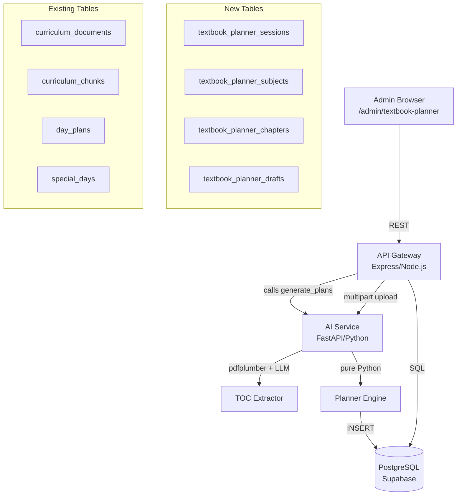

# Design Document: Textbook Planner Generator

## Overview

The Textbook Planner Generator is a multi-step wizard that lets school admins upload subject textbook PDFs, configure school parameters, and have the AI generate a structured day-by-day academic planner. The output is a `Planner_Draft` that the admin can preview and edit before confirming. On confirmation, the system converts the draft into `curriculum_documents` + `curriculum_chunks` records and invokes the existing `planner_service.generate_plans` for each section — making the generated planner indistinguishable from a manually uploaded curriculum PDF.

The feature is entirely admin-facing and sits behind the existing `jwtVerify + schoolScope + roleGuard('admin')` middleware chain. It does not change any existing tables or endpoints.

---

## Architecture



The wizard state is persisted in `textbook_planner_sessions`. Each session belongs to one class and one academic year. Subjects, chapters, and the generated draft rows are stored in their own tables. On confirmation, the system writes into the existing curriculum pipeline tables and calls the existing `generate_plans` endpoint — no changes to existing code paths.

---

## Components and Interfaces

### Frontend Wizard (`/admin/textbook-planner`)

A 5-step wizard implemented as a Next.js page with step state managed in React context:

| Step | Name | Key Actions |
|------|------|-------------|
| 1 | Subject Setup | Add subjects, upload PDFs, extract TOC, review/edit chapters |
| 2 | School Parameters | Verify academic year, working days, holidays, breaks, activities |
| 3 | Subject Allocation | Set weekly hours per subject, view utilisation |
| 4 | Test & Revision Config | Choose test scheduling mode, set revision buffer |
| 5 | Preview & Confirm | Review generated planner, edit entries, push to curriculum |

### API Gateway Routes (`/api/v1/admin/textbook-planner/*`)

```
POST   /sessions                          — create or resume a session for class+year
GET    /sessions/:sessionId               — get session state

POST   /sessions/:sessionId/subjects      — add a subject
DELETE /sessions/:sessionId/subjects/:subjectId

POST   /sessions/:sessionId/subjects/:subjectId/upload   — upload PDF, trigger TOC extraction
PATCH  /sessions/:sessionId/subjects/:subjectId/toc-page — re-run extraction on different page
GET    /sessions/:sessionId/subjects/:subjectId/chapters — list extracted chapters
POST   /sessions/:sessionId/subjects/:subjectId/chapters — add chapter manually
PATCH  /sessions/:sessionId/subjects/:subjectId/chapters/:chapterId
DELETE /sessions/:sessionId/subjects/:subjectId/chapters/:chapterId

PATCH  /sessions/:sessionId/parameters   — save school parameters
PATCH  /sessions/:sessionId/allocations  — save subject allocations
PATCH  /sessions/:sessionId/test-config  — save test schedule config

POST   /sessions/:sessionId/generate     — trigger planner generation (async)
GET    /sessions/:sessionId/draft        — get draft entries (paginated by week)
PATCH  /sessions/:sessionId/draft/:entryId — edit a draft entry
POST   /sessions/:sessionId/draft/revert — revert to last generated version
POST   /sessions/:sessionId/confirm      — push to curriculum pipeline
GET    /sessions/:sessionId/coverage     — get per-subject coverage summary
```

### AI Service Endpoints

**`POST /internal/extract-toc`** — multipart form with `file` (PDF) and `toc_page` (int). Returns:
```json
{
  "chapters": [
    { "title": "Chapter 1: Numbers", "topics": ["Counting", "Addition"], "page_start": 5, "page_end": 22 }
  ],
  "failed": false
}
```

**`POST /internal/generate-textbook-planner`** — JSON body with session configuration. Returns:
```json
{
  "entries": [
    {
      "date": "2025-06-02",
      "subject_id": "uuid",
      "subject_name": "Mathematics",
      "chapter_name": "Chapter 1: Numbers",
      "topic_name": "Counting",
      "duration_minutes": 45
    }
  ],
  "summary": {
    "total_teaching_days": 180,
    "total_exam_days": 12,
    "total_revision_days": 12,
    "subjects": [{ "name": "Mathematics", "coverage_pct": 100 }]
  }
}
```

---

## Data Models

### `textbook_planner_sessions`

```sql
CREATE TABLE textbook_planner_sessions (
    id              UUID PRIMARY KEY DEFAULT gen_random_uuid(),
    school_id       UUID NOT NULL REFERENCES schools(id) ON DELETE CASCADE,
    class_id        UUID NOT NULL REFERENCES classes(id) ON DELETE CASCADE,
    academic_year   TEXT NOT NULL,
    status          TEXT NOT NULL DEFAULT 'draft'
                    CHECK (status IN ('draft', 'generated', 'confirmed')),
    parameters      JSONB DEFAULT '{}',   -- breaks, activities, timings
    test_config     JSONB DEFAULT '{}',   -- mode, N, dates, duration_periods
    generation_summary JSONB,
    created_by      UUID REFERENCES users(id),
    created_at      TIMESTAMPTZ DEFAULT now(),
    updated_at      TIMESTAMPTZ DEFAULT now(),
    UNIQUE(school_id, class_id, academic_year)
);
```

`parameters` shape:
```json
{
  "school_start": "08:00", "school_end": "14:00",
  "lunch_start": "12:00", "lunch_end": "12:30",
  "snack_start": null, "snack_end": null,
  "sports_minutes_per_week": 60,
  "activities": [{ "name": "Assembly", "daily_minutes": 15 }]
}
```

`test_config` shape:
```json
{
  "mode": "end-of-chapter",
  "every_n_weeks": null,
  "specific_dates": [],
  "duration_periods": 2,
  "revision_buffer": true
}
```

### `textbook_planner_subjects`

```sql
CREATE TABLE textbook_planner_subjects (
    id              UUID PRIMARY KEY DEFAULT gen_random_uuid(),
    session_id      UUID NOT NULL REFERENCES textbook_planner_sessions(id) ON DELETE CASCADE,
    school_id       UUID NOT NULL REFERENCES schools(id) ON DELETE CASCADE,
    name            TEXT NOT NULL,
    pdf_path        TEXT,
    pdf_page_count  INT,
    toc_page        INT,
    weekly_hours    NUMERIC(4,2) DEFAULT 0,
    created_at      TIMESTAMPTZ DEFAULT now(),
    UNIQUE(session_id, name)
);
```

### `textbook_planner_chapters`

```sql
CREATE TABLE textbook_planner_chapters (
    id              UUID PRIMARY KEY DEFAULT gen_random_uuid(),
    subject_id      UUID NOT NULL REFERENCES textbook_planner_subjects(id) ON DELETE CASCADE,
    session_id      UUID NOT NULL REFERENCES textbook_planner_sessions(id) ON DELETE CASCADE,
    chapter_index   INT NOT NULL,
    title           TEXT NOT NULL,
    topics          JSONB NOT NULL DEFAULT '[]',  -- ["Topic A", "Topic B"]
    page_start      INT,
    page_end        INT,
    chapter_weight  NUMERIC(6,4),  -- computed: page_span / total_pages
    created_at      TIMESTAMPTZ DEFAULT now()
);
CREATE INDEX ON textbook_planner_chapters(subject_id, chapter_index);
```

### `textbook_planner_drafts`

```sql
CREATE TABLE textbook_planner_drafts (
    id              UUID PRIMARY KEY DEFAULT gen_random_uuid(),
    session_id      UUID NOT NULL REFERENCES textbook_planner_sessions(id) ON DELETE CASCADE,
    school_id       UUID NOT NULL REFERENCES schools(id) ON DELETE CASCADE,
    entry_date      DATE NOT NULL,
    subject_id      UUID REFERENCES textbook_planner_subjects(id),
    subject_name    TEXT NOT NULL,
    chapter_name    TEXT NOT NULL,
    topic_name      TEXT NOT NULL,
    duration_minutes INT NOT NULL,
    is_manual_edit  BOOLEAN DEFAULT false,
    carry_forward_from DATE,
    created_at      TIMESTAMPTZ DEFAULT now(),
    updated_at      TIMESTAMPTZ DEFAULT now()
);
CREATE INDEX ON textbook_planner_drafts(session_id, entry_date);
CREATE INDEX ON textbook_planner_drafts(session_id, subject_id);
```

### Relationship to Existing Tables

On confirmation, the system writes:
- One `curriculum_documents` row per session (`source = 'textbook_planner'`, `status = 'ready'`, `ingestion_stage = 'done'`)
- One `curriculum_chunks` row per draft entry, with `topic_label = "{subject} — {chapter}: {topic}"` and `content` containing the topic text
- `special_days` rows for exam and revision days (inserted during generation, before confirmation)

The `curriculum_documents` table needs two new columns added via migration:
```sql
ALTER TABLE curriculum_documents ADD COLUMN IF NOT EXISTS ingestion_stage TEXT DEFAULT 'done';
ALTER TABLE curriculum_documents ADD COLUMN IF NOT EXISTS source TEXT DEFAULT 'upload';
```

---

## Correctness Properties

*A property is a characteristic or behavior that should hold true across all valid executions of a system — essentially, a formal statement about what the system should do. Properties serve as the bridge between human-readable specifications and machine-verifiable correctness guarantees.*

### Property 1: Subject name uniqueness within a class

*For any* session and any set of subject names added to it, no two subjects in the session shall share the same name.

**Validates: Requirements 1.1**

---

### Property 2: File type rejection

*For any* file whose extension is not `.pdf` (case-insensitive), the upload endpoint shall reject it with an error response.

**Validates: Requirements 1.2**

---

### Property 3: TOC page boundary validation

*For any* uploaded PDF with N pages, a TOC page number P shall be accepted if and only if 1 ≤ P ≤ N. Any P outside this range shall be rejected with a validation error.

**Validates: Requirements 1.4**

---

### Property 4: Chapter list round-trip

*For any* chapter added to a subject's chapter list, querying the chapter list shall return that chapter. *For any* chapter removed from the list, querying the chapter list shall not return that chapter.

**Validates: Requirements 1.8**

---

### Property 5: Available teaching minutes calculation

*For any* school parameters configuration with school_start, school_end, and a set of break/activity durations, the computed available_teaching_minutes shall equal (school_end - school_start) in minutes minus the sum of all break and non-academic activity minutes. If the sum of non-teaching time ≥ total school day duration, the configuration shall be rejected.

**Validates: Requirements 2.14, 2.15**

---

### Property 6: Subject allocation total

*For any* set of subject weekly hour allocations, the displayed total shall equal the arithmetic sum of all individual allocations.

**Validates: Requirements 3.2**

---

### Property 7: Chapter weight normalisation

*For any* subject with a list of chapters each having a positive page span, the sum of all chapter weights shall equal 1.0 (within floating-point tolerance), and a chapter with a larger page span shall have a weight greater than or equal to a chapter with a smaller page span.

**Validates: Requirements 3.5**

---

### Property 8: Chapter weight monotonicity in day allocation

*For any* two chapters A and B within the same subject where A has a larger page span than B, the number of Teaching_Days allocated to A shall be greater than or equal to the number allocated to B.

**Validates: Requirements 3.6**

---

### Property 9: Periodic test day spacing

*For any* N in [1, 52] and any academic year date range, when every-N-weeks mode is selected, all inserted test days shall be exactly N × 7 calendar days apart from each other (subject to the constraint that they fall on working days — the nearest working day is used when the exact date is a non-working day).

**Validates: Requirements 4.3**

---

### Property 10: Test date conflict detection

*For any* set of proposed test dates and any set of holidays and full-day special days, a conflict warning shall be produced for every test date that overlaps with a holiday or full-day special day.

**Validates: Requirements 4.5**

---

### Property 11: Revision buffer precedes exam day

*For any* set of exam days and Teaching_Days, each exam day shall have exactly one revision day assigned to the nearest preceding Teaching_Day that is not already an exam, revision, or holiday.

**Validates: Requirements 5.1, 5.2, 5.3**

---

### Property 12: Teaching day count correctness

*For any* calendar configuration, the count of Teaching_Days shall equal the count of working days minus the count of holidays, full-day special days, exam days, and revision buffer days that fall on working days.

**Validates: Requirements 6.1**

---

### Property 13: Topic ordering preserved in draft

*For any* subject with an ordered list of topics in the TOC, the sequence of those topics in the generated Planner_Draft shall match the TOC order.

**Validates: Requirements 6.3**

---

### Property 14: Draft entry completeness

*For any* entry in a generated Planner_Draft, all five required fields (date, subject_name, chapter_name, topic_name, duration_minutes) shall be present and non-null.

**Validates: Requirements 6.4**

---

### Property 15: No topics dropped on overflow

*For any* subject where the number of topics exceeds the number of available Teaching_Days for that subject, all topics shall appear in the Planner_Draft (none shall be omitted).

**Validates: Requirements 6.5**

---

### Property 16: Carry-forward preserves topic order

*For any* carry-forward event on topic T at position i in a subject's topic sequence, all topics at positions > i shall appear one Teaching_Day later than their pre-carry-forward dates, and their relative order shall be unchanged.

**Validates: Requirements 7.2**

---

### Property 17: Curriculum chunk completeness on push

*For any* confirmed Planner_Draft entry, the resulting `curriculum_chunks` record shall have all required fields populated: `topic_label`, `content`, `chunk_index`, `class_id`, `school_id`, and `document_id`.

**Validates: Requirements 9.1**

---

### Property 18: Chapter status forward-only transitions

*For any* sequence of completion events applied to a chapter, the chapter's status shall only transition in the forward direction: `planned` → `in_progress` → `completed`. No backward transition shall occur.

**Validates: Requirements 10.1**

---

### Property 19: Pacing alert threshold

*For any* (elapsed_pct, coverage_pct) pair where elapsed_pct − coverage_pct > 15, a pacing alert shall be produced. *For any* pair where elapsed_pct − coverage_pct ≤ 15, no pacing alert shall be produced.

**Validates: Requirements 10.5**

---

### Property 20: Manual edits preserved on re-generation

*For any* set of manual edits applied to draft entries, and any re-generation that retains the associated Teaching_Days in the new schedule, all manual edits on retained days shall be present in the new draft.

**Validates: Requirements 11.3**

---

## Error Handling

| Scenario | Handling |
|----------|----------|
| PDF upload > 50 MB | Rejected at multer layer with 413 response |
| Non-PDF file type | Rejected before AI call; descriptive error returned |
| TOC page out of range | Validated against `pdf_page_count` stored on subject; 422 returned |
| TOC extraction returns empty | AI service returns `{ "chapters": [], "failed": true }`; gateway returns 422 with message; admin can retry with different page |
| LLM timeout during TOC extraction | AI service catches timeout, returns `failed: true`; gateway surfaces error |
| Generation timeout (> 30s) | Generation runs as background task; client polls `/sessions/:id` for status |
| Curriculum push partial failure | Transaction per section; failed sections rolled back; success sections committed; response lists per-section outcome |
| Duplicate session (same class + year) | `UNIQUE` constraint on sessions table; gateway returns existing session ID with 200 |
| Confirmed draft re-push attempt | Gateway checks `status = 'confirmed'` before push; returns 409 with informational message |
| Calendar change after generation | Session status set to `'stale'` via trigger or webhook; frontend shows re-generation banner |

---

## Testing Strategy

### Unit Tests

- `calculateAvailableMinutes(params)` — pure function, test with various break/activity combinations including edge cases (zero breaks, sum equals total, sum exceeds total)
- `calculateChapterWeights(chapters)` — verify normalisation and monotonicity
- `distributeTopicsAcrossDays(topics, days, weights)` — verify ordering, no drops, proportionality
- `detectTestDateConflicts(testDates, holidays, specialDays)` — verify all overlaps flagged
- `insertRevisionBuffers(examDays, teachingDays)` — verify each exam day gets a preceding revision day
- `applyCarryForward(entries, topicIndex)` — verify shift and order preservation
- `computePacingAlert(elapsedPct, coveragePct)` — verify 15% threshold boundary

### Property-Based Tests

Property-based testing is appropriate here because the core of this feature is a set of pure calculation and distribution functions (chapter weight normalisation, topic distribution, teaching day counting, carry-forward shifting) where input variation meaningfully exercises edge cases.

**Library**: `fast-check` (TypeScript, for API gateway logic) and `hypothesis` (Python, for AI service planner engine logic).

**Minimum 100 iterations per property test.**

Each test is tagged with a comment in the format:
`// Feature: textbook-planner-generator, Property N: <property_text>`

Properties to implement as automated tests:

| Property | Test Location | Library |
|----------|--------------|---------|
| 5 — Available teaching minutes | API gateway unit tests | fast-check |
| 6 — Subject allocation total | API gateway unit tests | fast-check |
| 7 — Chapter weight normalisation | AI service unit tests | hypothesis |
| 8 — Chapter weight monotonicity | AI service unit tests | hypothesis |
| 9 — Periodic test day spacing | AI service unit tests | hypothesis |
| 10 — Test date conflict detection | AI service unit tests | hypothesis |
| 11 — Revision buffer precedes exam | AI service unit tests | hypothesis |
| 12 — Teaching day count | AI service unit tests | hypothesis |
| 13 — Topic ordering preserved | AI service unit tests | hypothesis |
| 14 — Draft entry completeness | AI service unit tests | hypothesis |
| 15 — No topics dropped | AI service unit tests | hypothesis |
| 16 — Carry-forward preserves order | AI service unit tests | hypothesis |
| 18 — Chapter status forward-only | API gateway unit tests | fast-check |
| 19 — Pacing alert threshold | API gateway unit tests | fast-check |
| 20 — Manual edits preserved | AI service unit tests | hypothesis |

Properties 1–4 (subject uniqueness, file type, TOC page boundary, chapter round-trip) are better covered by example-based integration tests since they test database constraints and HTTP validation rather than pure logic.

Properties 17 (chunk completeness on push) is covered by an integration test that runs the full push flow against a test database.

### Integration Tests

- Full wizard flow: create session → add subjects → extract TOC → configure parameters → generate → confirm → verify `curriculum_chunks` and `day_plans` created
- Push failure rollback: mock `generate_plans` to fail for one section, verify other sections are unaffected and failed section has no orphaned chunks
- Re-generation preserves manual edits: apply edits, trigger re-generation, verify edits on surviving days are retained
- Calendar change stale detection: add a holiday after generation, verify session is marked stale
