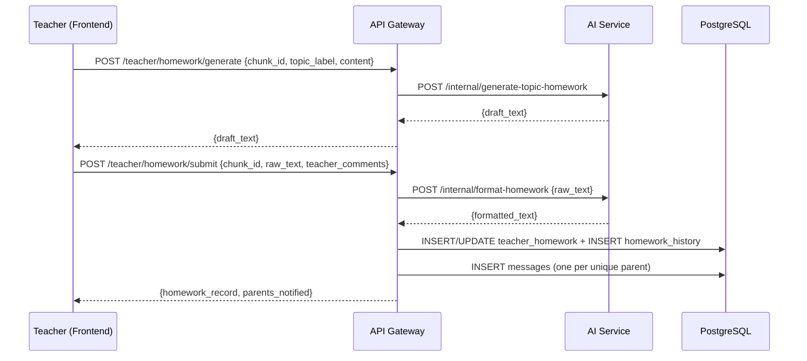

# Design Document: Topic-Level Homework Generation

## Overview

This feature replaces the per-topic checkboxes in the teacher's daily plan with a purposeful "Generate Homework" button per topic. The teacher clicks it, reviews and edits the AI draft, adds optional comments, confirms, and the system formats and delivers a parent-friendly message to all parents in the section.

The design reuses the existing `teacher_homework` table (extended with a `chunk_id` column), the existing `messages` table for delivery, and the existing `/internal/format-homework` AI endpoint. A new `/internal/generate-topic-homework` AI endpoint handles draft generation from topic content.

### Key Design Decisions

- **Extend `teacher_homework`, don't create a new table.** The table already has `section_id`, `teacher_id`, `raw_text`, `formatted_text`, and `homework_date`. Adding `chunk_id` and `teacher_comments` is sufficient. A `homework_history` table tracks edits.
- **One record per topic per day per section.** The unique constraint becomes `(section_id, homework_date, chunk_id)`.
- **Delivery via existing `messages` table.** No new delivery infrastructure needed. One message per unique parent, `sender_role = 'teacher'`.
- **Admin/principal view is a new read-only route** on the existing admin router pattern.

---

## Architecture



---

## Components and Interfaces

### AI Service — New Endpoint

**`POST /internal/generate-topic-homework`**

```python
class TopicHomeworkRequest(BaseModel):
    topic_label: str
    content: str          # curriculum chunk content
    school_id: str = ""
    section_id: str = ""
```

Response: `{"draft_text": str}`

The prompt instructs the LLM to produce homework in the same language as `content`, structured as:
1. What the child should do (brief, simple language)
2. Materials needed (if any)
3. Estimated time

### API Gateway — New Routes

Mounted at `/api/v1/teacher/homework` in a new file `routes/teacher/homework.ts`.

| Method | Path | Description |
|--------|------|-------------|
| `POST` | `/generate` | Call AI to generate a draft for a chunk |
| `POST` | `/submit` | Format + save + deliver to parents |
| `GET` | `/:chunkId` | Get existing record for a chunk on today's date |
| `PUT` | `/:id` | Edit existing record, re-format, re-deliver |

Mounted at `/api/v1/admin/homework` in a new file `routes/admin/homework.ts`.

| Method | Path | Description |
|--------|------|-------------|
| `GET` | `/` | List all homework records for the school (filterable) |

Query params for admin list: `?date=YYYY-MM-DD&class_id=&section_id=`

### Frontend — Changes to `teacher/page.tsx`

The daily plan chunk list gains a "Generate Homework" button per chunk. Clicking opens a modal (`HomeworkModal`) that handles the full generate → edit → preview → confirm flow.

The existing `homeworkText` / `savingHomework` / `existingHomework` state (which was for the old single-day homework panel) is replaced by per-chunk state.

A new admin page at `app/admin/homework/page.tsx` provides the homework list view.

---

## Data Models

### Migration 044 — Extend `teacher_homework` and add history

```sql
-- Extend teacher_homework for per-topic records
ALTER TABLE teacher_homework
  ADD COLUMN IF NOT EXISTS chunk_id UUID REFERENCES curriculum_chunks(id),
  ADD COLUMN IF NOT EXISTS topic_label TEXT,
  ADD COLUMN IF NOT EXISTS teacher_comments TEXT;

-- Drop old unique constraint (section_id, homework_date) — one per day
-- Replace with per-topic unique constraint
ALTER TABLE teacher_homework
  DROP CONSTRAINT IF EXISTS teacher_homework_section_id_homework_date_key;

ALTER TABLE teacher_homework
  ADD CONSTRAINT teacher_homework_section_chunk_date_key
  UNIQUE (section_id, chunk_id, homework_date);

-- History table for edit tracking (Requirement 7.4)
CREATE TABLE IF NOT EXISTS homework_history (
  id              UUID PRIMARY KEY DEFAULT gen_random_uuid(),
  homework_id     UUID NOT NULL REFERENCES teacher_homework(id) ON DELETE CASCADE,
  school_id       UUID NOT NULL REFERENCES schools(id) ON DELETE CASCADE,
  raw_text        TEXT NOT NULL,
  formatted_text  TEXT,
  teacher_comments TEXT,
  saved_at        TIMESTAMPTZ NOT NULL DEFAULT now(),
  saved_by        UUID REFERENCES users(id)
);

CREATE INDEX ON homework_history(homework_id, saved_at DESC);
```

### `teacher_homework` (after migration)

| Column | Type | Notes |
|--------|------|-------|
| `id` | UUID PK | |
| `school_id` | UUID FK | |
| `section_id` | UUID FK | |
| `teacher_id` | UUID FK | |
| `chunk_id` | UUID FK | `curriculum_chunks.id` — nullable for legacy rows |
| `topic_label` | TEXT | Snapshot of topic name at time of creation |
| `homework_date` | DATE | |
| `raw_text` | TEXT | Teacher's edited text |
| `teacher_comments` | TEXT | Optional separate comments field |
| `formatted_text` | TEXT | AI-formatted parent message |
| `created_at` | TIMESTAMPTZ | |
| `updated_at` | TIMESTAMPTZ | |

Unique: `(section_id, chunk_id, homework_date)`

### `homework_history`

| Column | Type | Notes |
|--------|------|-------|
| `id` | UUID PK | |
| `homework_id` | UUID FK | |
| `school_id` | UUID FK | |
| `raw_text` | TEXT | |
| `formatted_text` | TEXT | |
| `teacher_comments` | TEXT | |
| `saved_at` | TIMESTAMPTZ | |
| `saved_by` | UUID FK | |

### `messages` (unchanged)

Homework delivery reuses the existing table. The `body` field contains the `formatted_text` (or raw fallback). For updates, the body is prefixed with `📝 Updated Homework:\n`.

---

## Correctness Properties

*A property is a characteristic or behavior that should hold true across all valid executions of a system — essentially, a formal statement about what the system should do. Properties serve as the bridge between human-readable specifications and machine-verifiable correctness guarantees.*

### Property 1: Non-empty validation

*For any* string composed entirely of whitespace characters, submitting it as homework text should be rejected and no record should be created or updated.

**Validates: Requirements 3.5**

### Property 2: Homework record round-trip

*For any* valid homework submission (non-empty raw text, optional teacher comments, formatted text), saving the record and then retrieving it by `(section_id, chunk_id, homework_date)` should return both `raw_text` and `formatted_text` intact and equal to what was submitted.

**Validates: Requirements 4.5**

### Property 3: One message per unique parent

*For any* section with a set of parents (including parents with multiple students in the section), confirming homework delivery should create exactly one message row per unique `parent_id` — never more, never fewer.

**Validates: Requirements 5.1, 5.3**

### Property 4: All delivered messages have correct sender role

*For any* homework delivery, every message row inserted into the `messages` table should have `sender_role = 'teacher'`.

**Validates: Requirements 5.2**

### Property 5: Admin filter correctness

*For any* combination of `date`, `class_id`, and `section_id` filter values, every homework record returned by the admin list endpoint should satisfy all applied filters — no record outside the filter criteria should appear in the results.

**Validates: Requirements 6.3**

### Property 6: Admin list record completeness

*For any* homework record returned by the admin list endpoint, the response object should contain non-null values for `topic_label`, `homework_date`, `teacher_name`, `class_name`, `section_label`, and `formatted_text`.

**Validates: Requirements 6.4**

### Property 7: Update preserves history

*For any* homework record that is updated at least once, the `homework_history` table should contain at least two entries for that record's `homework_id`, and the earliest entry's `raw_text` should equal the original submission's `raw_text`.

**Validates: Requirements 7.4**

### Property 8: Updated messages carry the update marker

*For any* re-delivery of an existing homework record, every message inserted should have a `body` that starts with the update marker prefix (`📝 Updated Homework`).

**Validates: Requirements 7.3**

---

## Error Handling

| Scenario | Behavior |
|----------|----------|
| AI generation times out (>15s) | Return 504 from `/generate`; frontend shows error with retry button |
| AI formatting fails | Fall back to raw text as `formatted_text`; include `formatting_skipped: true` in response; frontend notifies teacher |
| Message delivery fails for some parents | Return partial success: `{ sent: [...], failed: [{parent_id, name}] }`; frontend shows failed names with retry option |
| Chunk already has homework for today | `GET /:chunkId` returns existing record; frontend shows "View / Edit" button |
| Submit with empty text | API returns 400; frontend disables submit button client-side |

---

## Testing Strategy

**Unit tests** (example-based):
- `POST /generate` calls AI with correct `topic_label` and `content` payload
- `POST /submit` calls `/internal/format-homework` with combined raw text + comments
- Fallback: when AI format fails, `formatted_text` equals `raw_text`
- Admin list endpoint returns records filtered by date/class/section
- Update marker prefix is applied on re-delivery

**Property-based tests** (using [fast-check](https://github.com/dubzzz/fast-check) for TypeScript):
- Property 1: Whitespace-only strings rejected (generate arbitrary whitespace strings)
- Property 2: Round-trip save/retrieve (generate arbitrary valid homework payloads)
- Property 3: One message per unique parent (generate sections with varying parent/student configurations)
- Property 4: All messages have `sender_role = 'teacher'` (generate arbitrary delivery scenarios)
- Property 5: Admin filter correctness (generate arbitrary filter combinations against seeded data)
- Property 6: Admin list completeness (generate arbitrary homework records, verify all fields present)
- Property 7: History preservation (generate arbitrary update sequences)
- Property 8: Update marker invariant (generate arbitrary re-delivery scenarios)

Each property test runs a minimum of 100 iterations.
Tag format: `// Feature: topic-homework-generation, Property N: <property_text>`

**Integration tests**:
- End-to-end: generate → submit → verify messages in DB
- AI timeout handling (mock AI service to delay >15s)
- Partial delivery failure and retry
